# 🐳 Docker Complete Notes
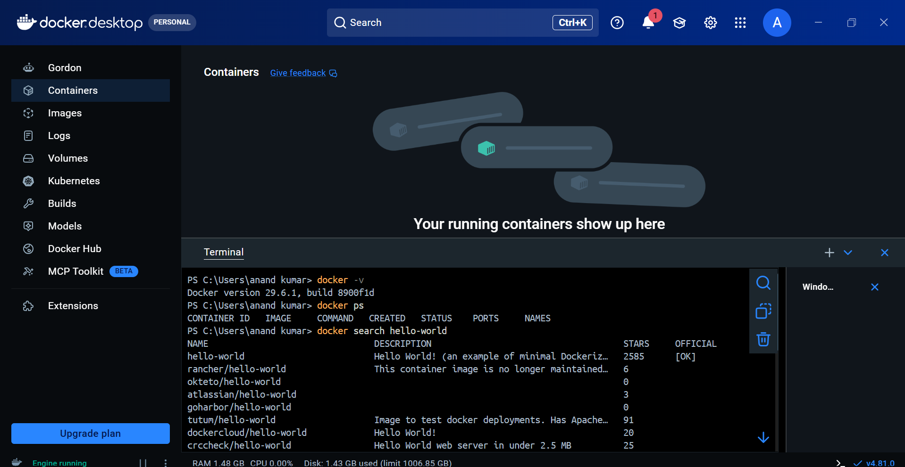
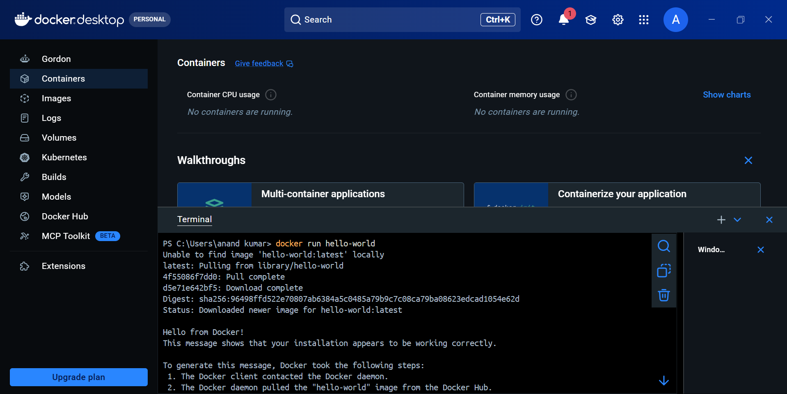
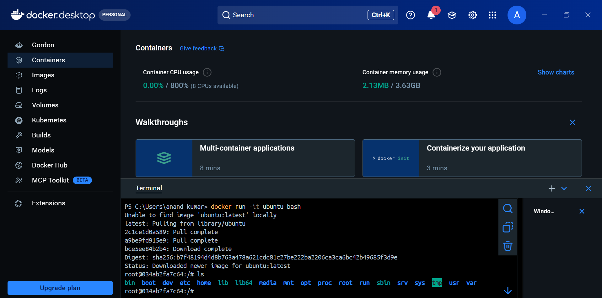

> Beginner-friendly Docker Notes (README.md)

---

# Table of Contents

1. Docker Fundamentals
2. Why Docker?
3. What is Docker?
4. How Docker Works
5. Docker Architecture
6. Dockerfile
7. Docker Image
8. Docker Container
9. Docker Registry
10. Before Docker (Virtualization)
11. Virtualization Architecture
12. Containerization Architecture
13. Virtualization vs Containerization
14. Real-Life Examples
15. Docker Workflow
16. Important Interview Questions

---

# 1. Docker Fundamentals

## What is Docker?

Docker is an open-source **Containerization Platform** that packages an application along with its dependencies, libraries, configurations, permissions, and runtime into a **Container**.

The application runs exactly the same on every machine.

> **Build Once → Run Anywhere**

---

# Why Docker?

Suppose you develop an application on your laptop.

## 👨‍💻 Owner Machine

```
Operating System
Windows 11

Applications
├── Python 3.14
├── VS Code
├── Git
├── Docker Desktop

Libraries
Permissions
Configurations
Environment Variables
```

Everything works perfectly.

---

## 👤 Client Machine

```
Operating System
Ubuntu Linux

Applications
├── Python 3.11
├── Missing Libraries

Different Permissions
Different Environment
```

Result

```
❌ Application Failed
```

Problems

- Different OS
- Different Python Version
- Missing Libraries
- Missing Dependencies
- Different Configuration

---

## Docker Solution

Docker packages everything together.

```
Application
│
├── Python
├── Libraries
├── Dependencies
├── Permissions
├── Environment Variables
└── Configuration
```

Now the application runs on

- Windows
- Linux
- macOS
- AWS EC2
- Azure
- Google Cloud

without changing anything.

---

# How Docker Works

```
Developer
     │
     ▼
Create Dockerfile
     │
     ▼
Build Docker Image
     │
     ▼
Run Docker Container
     │
     ▼
Application Runs Anywhere
```

---

# Docker Architecture

```
             Docker Registry
             (Docker Hub)
                  ▲
                  │
            Push / Pull
                  │
                  ▼

Developer
     │
Dockerfile
     │
docker build
     │
Docker Image
     │
docker run
     │
Docker Container
     │
Docker Engine
     │
Host Operating System
     │
Laptop / EC2 / Cloud
```

---

# Dockerfile

A Dockerfile is a text file that contains instructions to create a Docker Image.

Example

```dockerfile
FROM python:3.14

WORKDIR /app

COPY . .

RUN pip install -r requirements.txt

CMD ["python","app.py"]
```

Think of it as

```
Recipe
   │
   ▼
Cake

Dockerfile
      │
      ▼
Docker Image
```

---

# Docker Image

A Docker Image is a **Blueprint** or **Template**.

It contains

- Application Code
- Runtime
- Libraries
- Dependencies
- OS Packages

Image cannot run directly.

```
Dockerfile
      │
      ▼
Docker Image
```

Examples

```
python:3.14

ubuntu:24.04

nginx

mysql
```

---

# Docker Container

Container is a running instance of an Image.

```
Docker Image
      │
docker run
      │
      ▼
Docker Container
```

Container contains

- Application
- Runtime
- Libraries
- Dependencies

Containers are lightweight.

---

# Docker Registry

Docker Registry stores Docker Images.

Popular Registries

- Docker Hub
- AWS ECR
- Azure Container Registry
- Google Artifact Registry
- Harbor Registry

Example

```bash
docker pull nginx

docker push myapp:v1
```

---

# Before Docker

Before Docker, companies used **Virtual Machines (VMs).**

Each application required a complete Operating System.

---

# Virtualization Architecture

```
Application 1
Operating System
---------------------

Application 2
Operating System
---------------------

Application 3
Operating System

=====================
Hypervisor
(VirtualBox / VMware)

=====================
Operating System

Windows
Linux
macOS

=====================
Host Machine

CPU
RAM
Storage
Network
```

---

# Hypervisor

Hypervisor creates Virtual Machines.

Examples

- Oracle VirtualBox
- VMware
- Hyper-V
- KVM

Each VM has

- Own Operating System
- Own RAM
- Own Storage

---

# Real-Life Example (Virtualization)

Imagine building your own house on a plot.

```
🏠 House

🏊 Personal Swimming Pool

⚡ Personal Inverter

💧 Personal Water Tank

🎮 Personal Playground
```

Everything is dedicated.

Advantages

- Isolation
- Privacy

Disadvantages

- High Cost
- Resource Wastage

---

# Containerization (Docker)

Docker shares the Host Operating System.

```
Application 1

Application 2

Application 3

==================

Docker Engine

==================

Operating System

Windows
Linux
macOS

==================

Host Machine

CPU
RAM
Storage
Network
```

Docker Engine communicates with the Host OS.

Resources are shared.

---

# Docker Engine

Docker Engine is responsible for

- Building Images
- Running Containers
- Managing Containers
- Managing Networks
- Managing Volumes
- Pulling Images
- Pushing Images

On Windows

```
Docker Desktop

       │

Docker Engine

       │

Windows OS
```

---

# Real-Life Example (Docker)

Apartment Example

```
🏢 Apartment

Flat 1

Flat 2

Flat 3

Shared Resources

🏊 Swimming Pool

⚡ Inverter

💧 Water Tank

🚗 Parking
```

Resources are shared.

Less Cost

Better Utilization

---

# Virtualization vs Containerization

| Virtualization | Containerization |
|----------------|------------------|
| Plot House | Apartment |
| Uses Hypervisor | Uses Docker Engine |
| Separate Guest OS | Shared Host OS |
| Heavy | Lightweight |
| Slow Startup | Fast Startup |
| High RAM Usage | Low RAM Usage |
| High Storage | Low Storage |
| More Cost | Less Cost |
| Resource Wastage | Resource Optimization |
| VM Image | Docker Image |

---

# Example

## Virtualization

```
Laptop

↓

VirtualBox

↓

Ubuntu VM

↓

Python Application
```

---

## Docker

```
Laptop

↓

Docker Engine

↓

Python Container
```

---

# Docker Workflow

```
Developer

      │

Write Dockerfile

      │

docker build

      │

Docker Image

      │

docker push

      │

Docker Registry

      │

docker pull

      │

docker run

      │

Docker Container

      │

Application Running
```

---

# Popular Docker Commands

```bash
docker --version

docker images

docker ps

docker ps -a

docker pull nginx

docker run nginx

docker stop <container-id>

docker start <container-id>

docker rm <container-id>

docker rmi <image-id>

docker build -t myapp .

docker push myapp:v1

docker logs <container-id>

docker exec -it <container-id> bash
```

---

# Interview Questions

### What is Docker?

Docker is an open-source containerization platform that packages applications and dependencies into containers.

---

### What is Dockerfile?

A text file containing instructions to build Docker Images.

---

### What is Docker Image?

A read-only blueprint used to create Docker Containers.

---

### What is Docker Container?

A running instance of a Docker Image.

---

### What is Docker Registry?

A repository that stores Docker Images.

---

### Difference between Image and Container?

| Image | Container |
|--------|-----------|
| Blueprint | Running Instance |
| Read Only | Read & Write |
| Cannot Execute | Executable |

---

### Difference between VM and Docker?

| Virtual Machine | Docker |
|-----------------|--------|
| Hypervisor | Docker Engine |
| Guest OS | Shared Host OS |
| Heavy | Lightweight |
| Slow | Fast |
| High Resource Usage | Low Resource Usage |

---

# Summary

```
Dockerfile
      │
      ▼
Docker Image
      │
docker run
      ▼
Docker Container
      │
Runs Anywhere
```

## Remember

- Dockerfile → Recipe
- Image → Blueprint
- Container → Running Application
- Registry → Image Store
- Docker Engine → Runs Containers
- Hypervisor → Runs Virtual Machines

> **Docker = Build Once, Run Anywhere 🚀**

..........................................................................................................................
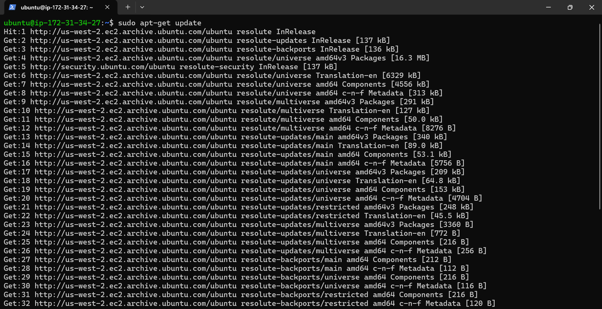
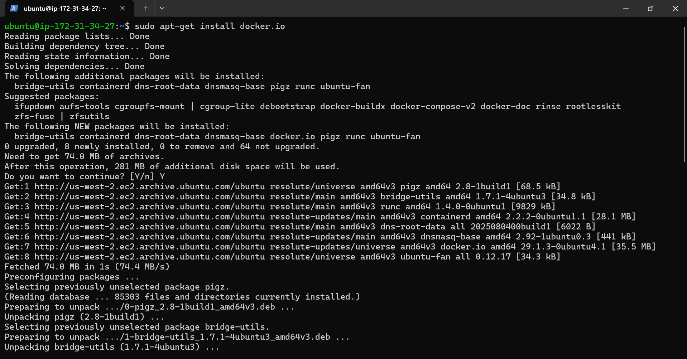
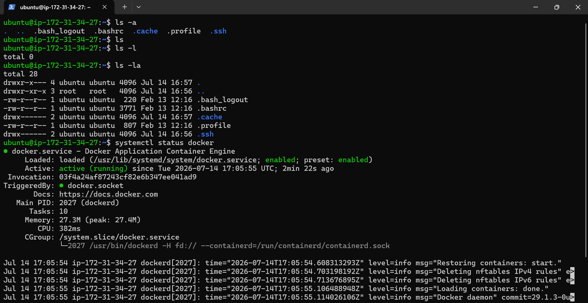
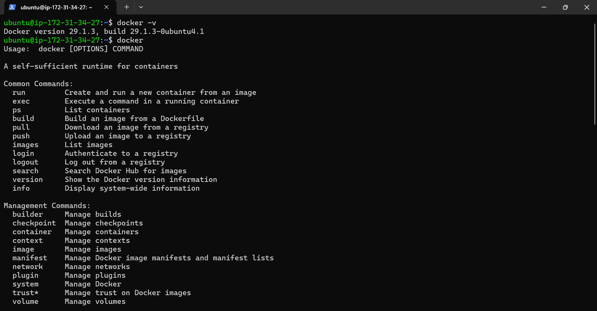
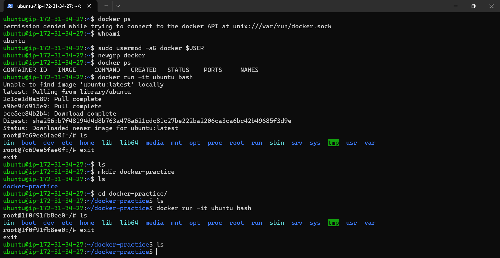
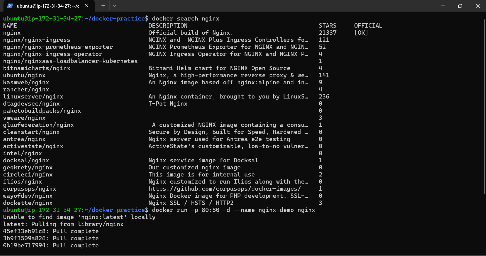
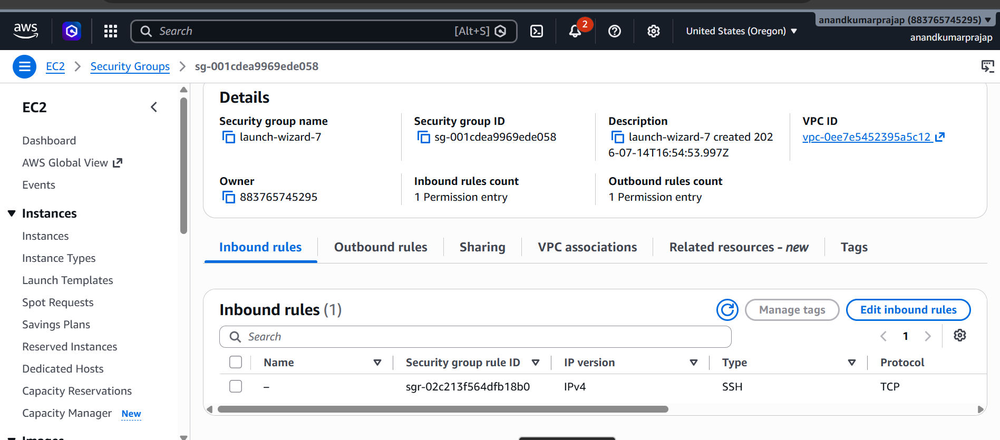
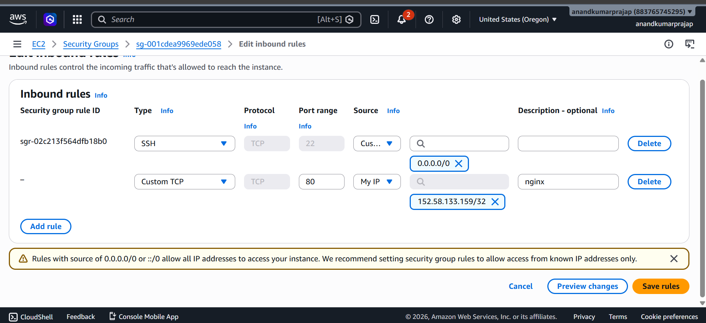
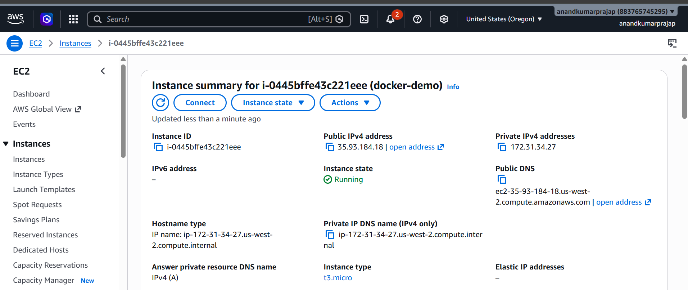
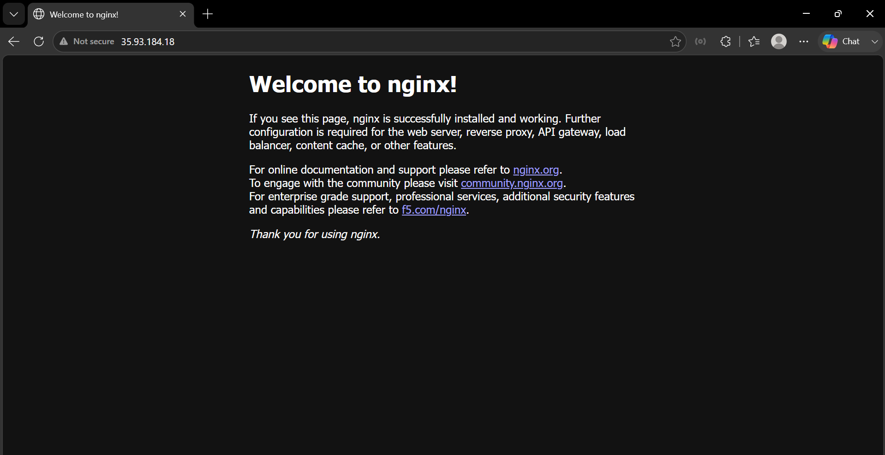
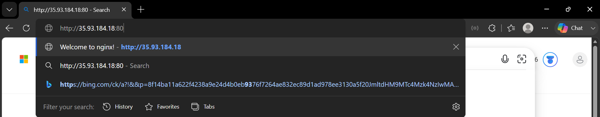
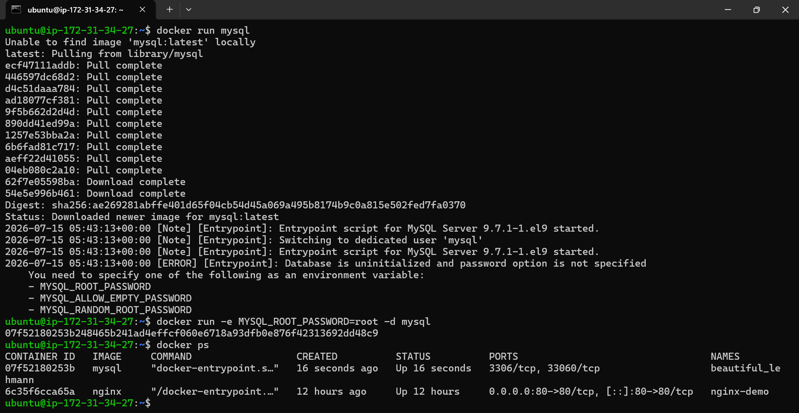
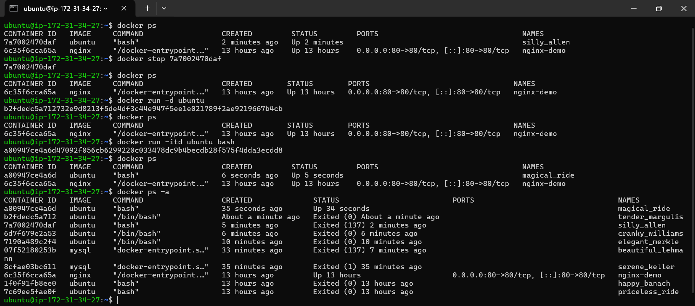
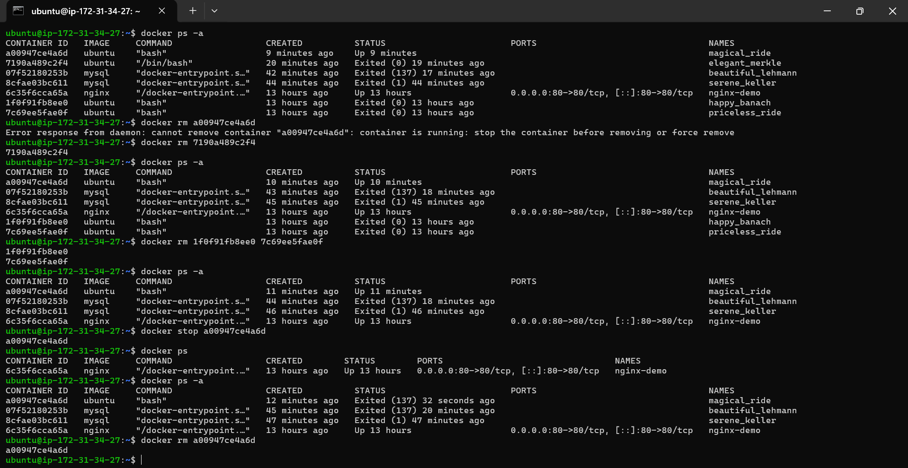
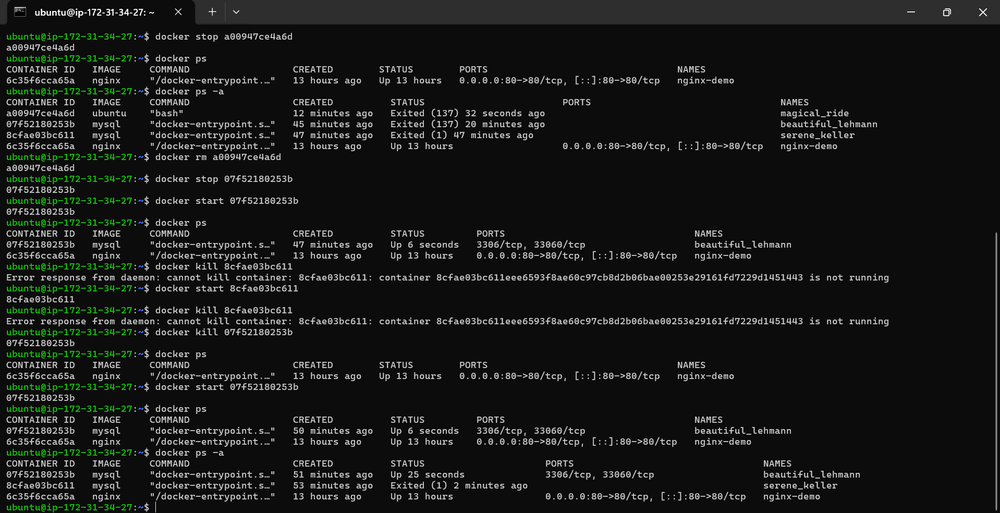
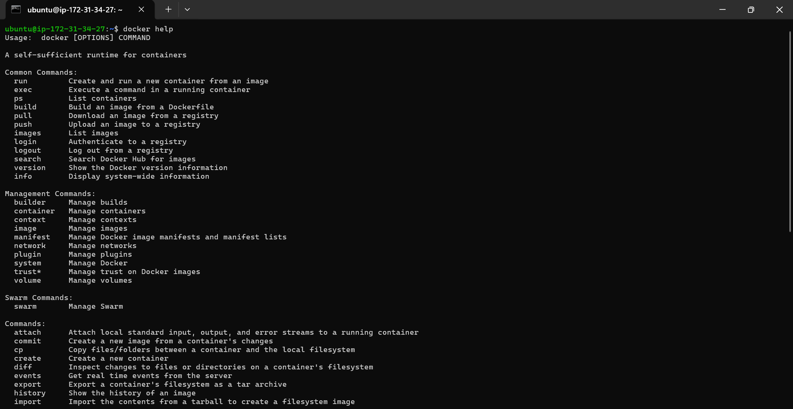
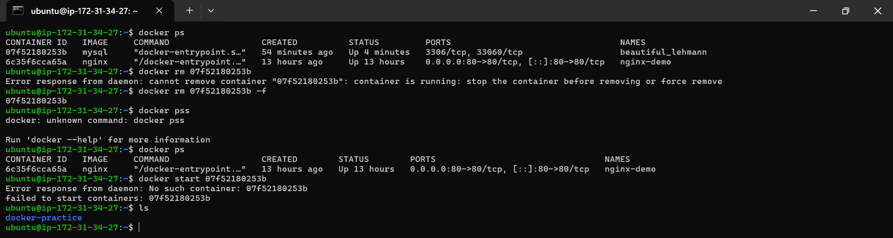

# 🐳 Docker Hands-on Notes (Hello World & Ubuntu Container)

## Objective

Learn how to:
- Verify Docker installation
- Search images from Docker Hub
- Download Docker images
- Run Docker containers
- Access an interactive Ubuntu container

---

# 1. Verify Docker Installation

### Command

```powershell
docker -v
```

### Output

```text
Docker version 29.6.1, build 8900f1d
```

### Observation

- Docker is successfully installed.
- Current Docker version is **29.6.1**.

---

# 2. Check Running Containers

### Command

```powershell
docker ps
```

### Output

```text
CONTAINER ID   IMAGE   COMMAND   CREATED   STATUS   PORTS   NAMES
```

### Observation

- No containers are currently running.

---

# 3. Search an Image from Docker Hub

### Command

```powershell
docker search hello-world
```

### Output

```text
NAME          DESCRIPTION                     OFFICIAL
hello-world   Hello World! example image      [OK]
```

### Observation

- Docker searched Docker Hub.
- The official **hello-world** image is available.

---

# 4. Run Hello World Container

### Command

```powershell
docker run hello-world
```

### Docker Process

```
docker run hello-world

        │

Image exists locally?

       No

        │

Pull Image from Docker Hub

        │

Create Container

        │

Run Container

        │

Display Output

        │

Container Stops
```

### Output

```text
Unable to find image 'hello-world:latest' locally

Pulling from library/hello-world

Status: Downloaded newer image

Hello from Docker!
```

### What Happened?

Docker performed the following steps:

1. Docker Client sent a request.
2. Docker Daemon contacted Docker Hub.
3. Pulled the **hello-world** image.
4. Created a container.
5. Executed the container.
6. Displayed the message.
7. Container exited automatically.

---

# 5. Run Ubuntu Container

### Command

```powershell
docker run -it ubuntu bash
```

> **Note:** The correct command uses `-it` (with a hyphen).

### Docker Process

```
docker run -it ubuntu bash

        │

Pull Ubuntu Image

        │

Create Container

        │

Start Container

        │

Launch Bash Shell

        │

Interactive Terminal
```

### Output

```text
root@34ab2fa7c64:/#
```

### Observation

- Ubuntu image was downloaded.
- A new Ubuntu container was created.
- Bash shell opened inside the container.

---

# 6. List Files Inside Container

### Command

```bash
ls
```

### Output

```text
bin
boot
dev
etc
home
lib
lib64
media
mnt
opt
proc
root
run
sbin
srv
sys
tmp
usr
var
```

### Observation

These are the root directories of the Ubuntu Linux filesystem.

---

# Docker Architecture During `docker run`

```
User
   │
   ▼
Docker CLI
   │
   ▼
Docker Daemon
   │
   ▼
Docker Hub
   │
Download Image
   │
Create Container
   │
Run Container
```

---

# Commands Used

```powershell
docker -v

docker ps

docker search hello-world

docker run hello-world

docker run -it ubuntu bash

ls
```

---

# Key Learnings

- `docker -v` → Check Docker version.
- `docker ps` → Show running containers.
- `docker search` → Search images on Docker Hub.
- `docker run` → Download (if needed) and start a container.
- `-i` → Interactive mode.
- `-t` → Allocate a terminal.
- `bash` → Open Bash shell inside the container.
- `ls` → List files and directories inside the container.

---

# Summary

```
Docker Hub
     │
     ▼
docker pull (automatic)
     │
Docker Image
     │
docker run
     ▼
Docker Container
     │
bash
     ▼
Linux Terminal
```

## Conclusion

In this lab, Docker was successfully installed and verified. The official **hello-world** image was pulled from Docker Hub and executed to confirm the installation. An **Ubuntu** container was then started in interactive mode using Bash, allowing access to a Linux environment inside the container.
