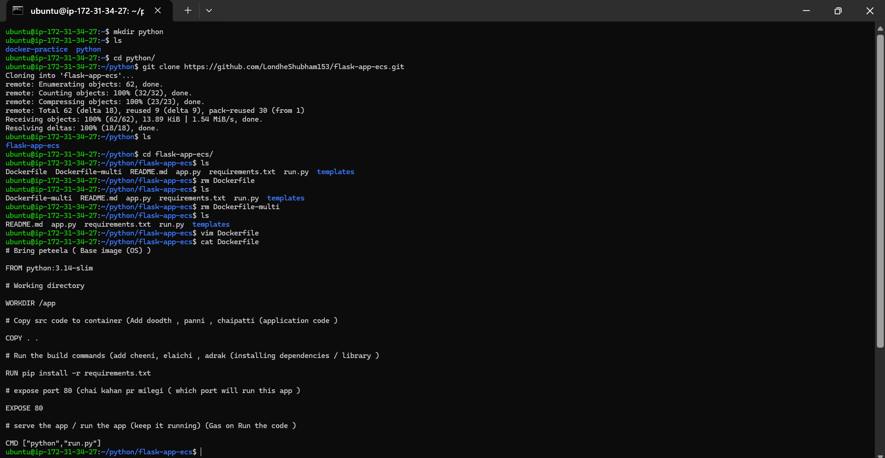
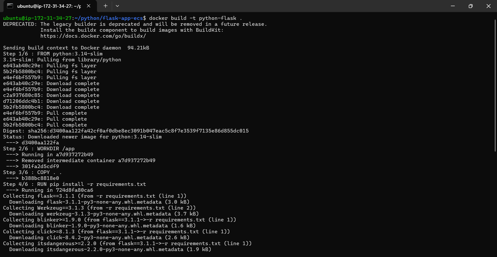
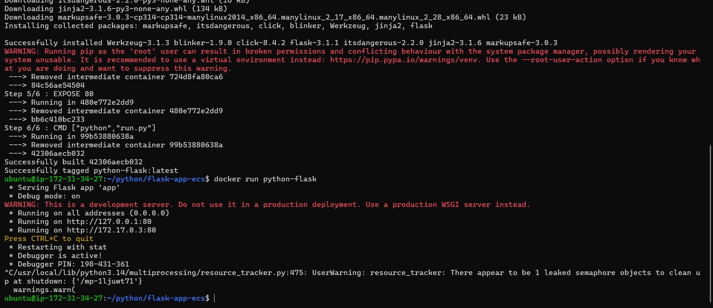
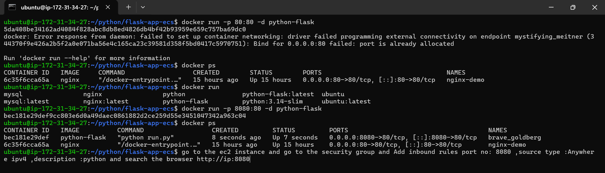
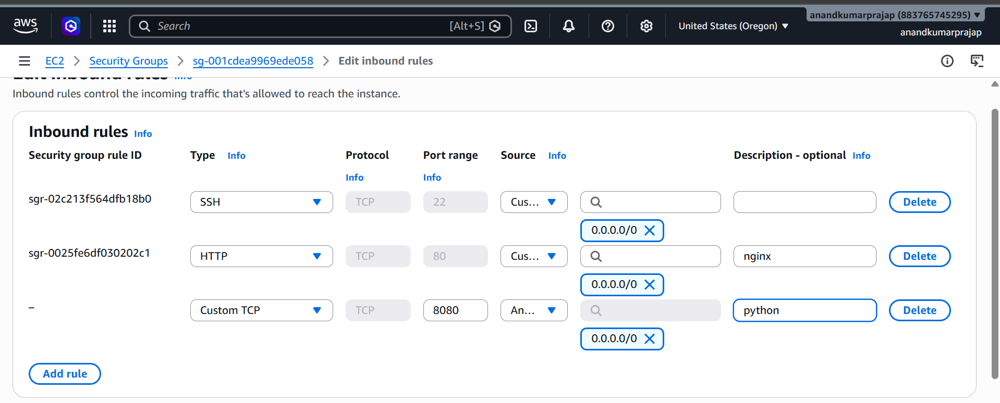
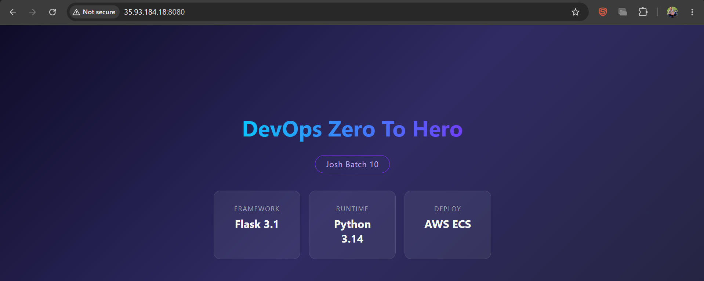
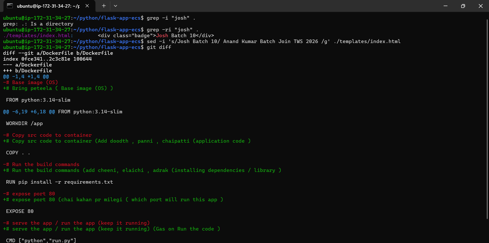
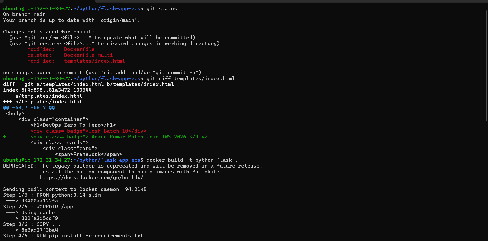
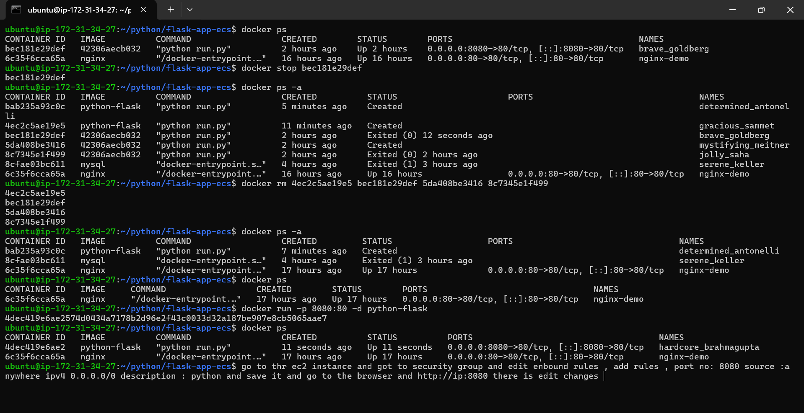
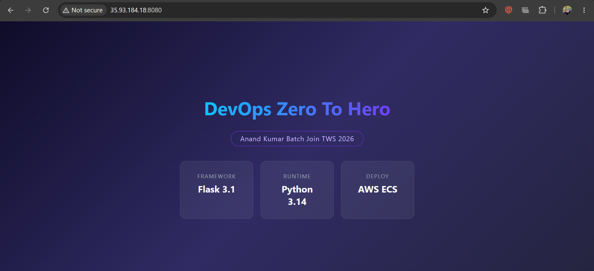

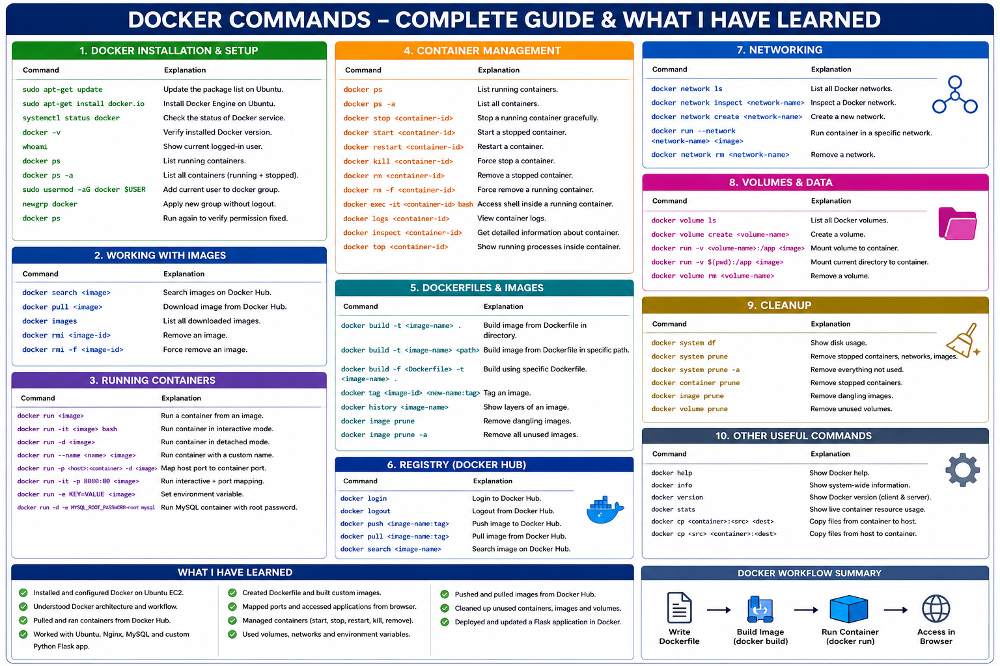
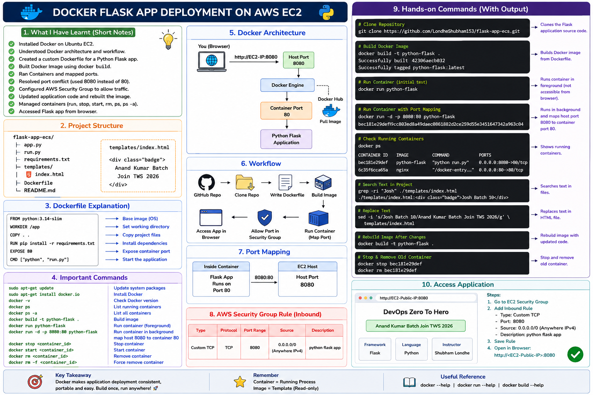

# 🐳 Docker Flask Application Deployment on AWS EC2

## Objective

Deploy a Python Flask application inside a Docker container on an AWS EC2 Ubuntu instance and access it through a web browser.

---

# Project Workflow

```
GitHub Repository
        │
        ▼
Clone Project
        │
        ▼
Create Dockerfile
        │
        ▼
Build Docker Image
        │
        ▼
Run Docker Container
        │
        ▼
Expose Port
        │
        ▼
Configure AWS Security Group
        │
        ▼
Access Application
```

---

# Step 1 - Create Project Directory

```bash
mkdir python
```

Move into directory

```bash
cd python
```

Verify

```bash
ls
```

Output

```
python
```

---

# Step 2 - Clone GitHub Repository

```bash
git clone https://github.com/LondheShubham153/flask-app-ecs.git
```

Move inside project

```bash
cd flask-app-ecs
```

Verify files

```bash
ls
```

Output

```
Dockerfile
Dockerfile-multi
README.md
app.py
requirements.txt
run.py
templates/
```

---

# Step 3 - Remove Existing Dockerfiles

Delete Dockerfile

```bash
rm Dockerfile
```

Delete Multi-stage Dockerfile

```bash
rm Dockerfile-multi
```

Verify

```bash
ls
```

Output

```
README.md
app.py
requirements.txt
run.py
templates/
```

---

# Step 4 - Create a New Dockerfile

```bash
vim Dockerfile
```

Dockerfile

```dockerfile
# Base Image
FROM python:3.14-slim

# Working Directory
WORKDIR /app

# Copy Project Files
COPY . .

# Install Dependencies
RUN pip install -r requirements.txt

# Application Port
EXPOSE 80

# Start Application
CMD ["python","run.py"]
```

Verify

```bash
cat Dockerfile
```

---

# Dockerfile Explanation

## Base Image

```dockerfile
FROM python:3.14-slim
```

Downloads the lightweight Python image.

---

## Working Directory

```dockerfile
WORKDIR /app
```

Creates and switches to the `/app` directory inside the container.

---

## Copy Files

```dockerfile
COPY . .
```

Copies the project files from the local machine into the container.

---

## Install Dependencies

```dockerfile
RUN pip install -r requirements.txt
```

Installs all Python packages listed in `requirements.txt`.

---

## Expose Port

```dockerfile
EXPOSE 80
```

Indicates that the application listens on port **80**.

---

## Run Application

```dockerfile
CMD ["python","run.py"]
```

Starts the Flask application when the container runs.

---

# Docker Image Build Process

```bash
docker build -t python-flask .
```

Explanation

| Option | Meaning |
|---------|----------|
| `docker build` | Build Docker Image |
| `-t` | Assign Image Name |
| `python-flask` | Image Name |
| `.` | Current Directory (Build Context) |

Output

```
Successfully built
Successfully tagged python-flask:latest
```

Verify images

```bash
docker images
```

---

# Step 5 - Run Flask Container

```bash
docker run python-flask
```

Output

```
Running on http://127.0.0.1:80
Running on http://172.17.0.x:80
```

The application runs inside the container but is **not accessible** from outside because no port is mapped.

---

# Step 6 - Port Mapping

Run

```bash
docker run -p 80:80 -d python-flask
```

Error

```
Bind for 0.0.0.0:80 failed

Port is already allocated.
```

### Reason

Nginx is already using Host Port **80**.

Check

```bash
docker ps
```

Output

```
nginx-demo
0.0.0.0:80->80/tcp
```

---

# Solution

Run Flask on another Host Port.

```bash
docker run -d -p 8080:80 python-flask
```

Meaning

```
Host Port

8080

        │

Container Port

80
```

Now verify

```bash
docker ps
```

Output

```
0.0.0.0:8080->80/tcp
```

---

# Container Architecture

```
Browser

      │

http://EC2-Public-IP:8080

      │

Host Port 8080

      │

Docker Engine

      │

Container Port 80

      │

Python Flask Application
```

---

# Step 7 - Configure AWS Security Group

Open

```
EC2 Console

↓

Select Instance

↓

Security

↓

Security Group

↓

Edit Inbound Rules
```

Add Rule

| Type | Port | Source | Description |
|------|------|--------|-------------|
| Custom TCP | 8080 | 0.0.0.0/0 | Python Flask |

Save.

---

# Step 8 - Access Application

Open browser

```
http://<EC2-Public-IP>:8080
```

Result

```
Python Flask Application Running
```

---

# Step 9 - Search Text in Project

Search

```bash
grep -ri "Josh"
```

Output

```
templates/index.html
```

---

# Step 10 - Replace Text

Replace

```bash
sed -i 's/Josh Batch 10/Anand Kumar Batch Join TWS 2026/g' templates/index.html
```

Meaning

- Search **Josh Batch 10**
- Replace with **Anand Kumar Batch Join TWS 2026**

---

# Step 11 - Verify Changes

Show modified lines

```bash
git diff templates/index.html
```

Output

```diff
- Josh Batch 10
+ Anand Kumar Batch Join TWS 2026
```

Check repository status

```bash
git status
```

Shows

```
Modified

Dockerfile

templates/index.html

Deleted

Dockerfile-multi
```

---

# Step 12 - Rebuild Image

```bash
docker build -t python-flask .
```

A new image is created with the updated HTML.

---

# Step 13 - Stop Running Container

```bash
docker stop <container-id>
```

Example

```bash
docker stop bec181e29def
```

---

# Step 14 - Remove Old Containers

View all containers

```bash
docker ps -a
```

Remove

```bash
docker rm <container-id>
```

Remove multiple

```bash
docker rm id1 id2 id3
```

Force remove

```bash
docker rm -f <container-id>
```

---

# Step 15 - Run Updated Application

```bash
docker run -d -p 8080:80 python-flask
```

Verify

```bash
docker ps
```

Output

```
0.0.0.0:8080->80/tcp
```

Open

```
http://<EC2-Public-IP>:8080
```

Now the webpage displays

```
Anand Kumar Batch Join TWS 2026
```

---

# Commands Used

```bash
mkdir python

cd python

git clone https://github.com/LondheShubham153/flask-app-ecs.git

cd flask-app-ecs

rm Dockerfile

rm Dockerfile-multi

vim Dockerfile

cat Dockerfile

docker build -t python-flask .

docker images

docker run python-flask

docker run -d -p 8080:80 python-flask

docker ps

docker ps -a

docker stop <container-id>

docker rm <container-id>

grep -ri "Josh"

sed -i 's/Josh Batch 10/Anand Kumar Batch Join TWS 2026/g' templates/index.html

git diff

git status
```

---

# Complete Deployment Flow

```
GitHub Repository
        │
        ▼
Clone Repository
        │
        ▼
Create Dockerfile
        │
        ▼
Build Docker Image
        │
        ▼
Docker Image
        │
        ▼
Run Docker Container
        │
        ▼
Map Port (8080 → 80)
        │
        ▼
AWS Security Group
        │
        ▼
Browser
        │
        ▼
http://EC2-Public-IP:8080
```

---

# Key Learnings

- Cloned a Flask application from GitHub.
- Created a custom Dockerfile.
- Built a Docker image using `docker build`.
- Ran the Flask application inside a Docker container.
- Understood host-to-container port mapping.
- Fixed port conflicts by using a different host port (8080).
- Configured AWS Security Group to allow external access.
- Modified application content using `grep` and `sed`.
- Verified code changes with `git diff` and `git status`.
- Rebuilt and redeployed the Docker image with updated content.

---

# Conclusion

This hands-on exercise demonstrated the complete Docker workflow for deploying a Python Flask application on an AWS EC2 instance. It covered cloning a project from GitHub, writing a Dockerfile, building an image, running a container, exposing ports, configuring AWS networking, updating application code, rebuilding the image, and redeploying the application successfully.
