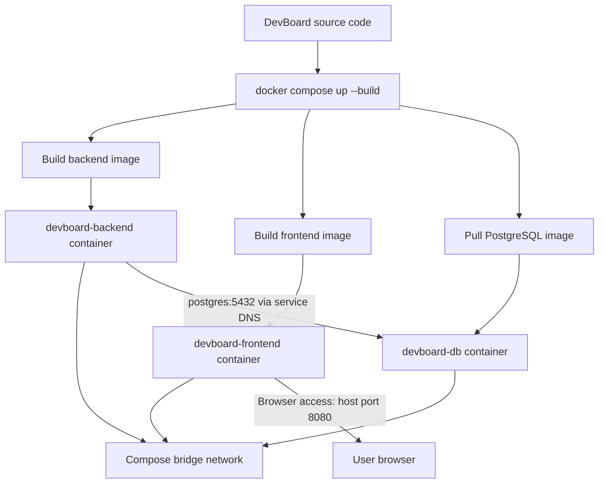

# DevBoard Dockerfiles — Step-by-Step Explanation

## 1. Purpose

This note explains how Dockerfiles build the **DevBoard frontend and Go backend** images used by the Docker Compose lab.

A `Dockerfile` is a set of build instructions. Docker reads it to create an **image**. Docker Compose then creates and runs containers from those images.

> The lab output confirms the backend uses `golang:1.22-alpine` and the frontend uses `node:20-alpine`. The original Dockerfile text was not fully visible in the lab notes, so the examples below are representative explanations of the build stages shown in the logs, not a verbatim copy of every original line.

## 2. Project layout

```text
devboard/
├── docker-compose.yml
├── .env
├── backend/
│   ├── Dockerfile
│   ├── go.mod
│   ├── go.sum
│   └── Go source files
├── frontend/
│   ├── Dockerfile
│   ├── package.json
│   ├── package-lock.json
│   ├── vite.config.js
│   ├── vite.preview.config.js
│   ├── src/
│   └── public/
└── init/
    └── postgres/
```

Compose uses `build: ./backend` and `build: ./frontend`. Each path is a build context; Docker looks for a file named `Dockerfile` in that directory by default.

## 3. How the pieces fit together



The Dockerfiles build the application images. `docker-compose.yml` configures the three services, their ports, environment variables, dependency order, network, and persistent database volume.

## 4. Backend Dockerfile — Go API

The lab build output shows a seven-step backend build based on `golang:1.22-alpine`, with the resulting container running `./devboard-backend`.

A representative multi-stage Dockerfile is:

```dockerfile
# Stage 1: compile the Go application
FROM golang:1.22-alpine AS builder

WORKDIR /app

# Copy dependency manifests first
COPY go.mod go.sum ./
RUN go mod download

# Copy application source
COPY . .

# Compile a Linux executable
RUN CGO_ENABLED=0 GOOS=linux go build -o devboard-backend .

# Stage 2: run the compiled application
FROM alpine:3.20

WORKDIR /app

# Copy only the executable from the builder stage
COPY --from=builder /app/devboard-backend ./devboard-backend

EXPOSE 8080

CMD ["./devboard-backend"]
```

### Line-by-line explanation

| Instruction | What it does |
|---|---|
| `FROM golang:1.22-alpine AS builder` | Starts the build stage from an image containing the Go 1.22 toolchain on Alpine Linux. `AS builder` names this stage so later instructions can copy its output. |
| `WORKDIR /app` | Sets `/app` as the working directory for subsequent commands. Docker creates it if needed. |
| `COPY go.mod go.sum ./` | Copies Go dependency manifests into the image before the rest of the source. |
| `RUN go mod download` | Downloads the modules listed by the Go project. Keeping this before the source copy can improve build-cache reuse when only application code changes. |
| `COPY . .` | Copies the backend build context into `/app`. A `.dockerignore` file should exclude items such as `.git` and local build artifacts. |
| `RUN CGO_ENABLED=0 GOOS=linux go build -o devboard-backend .` | Compiles the Go package into a Linux executable named `devboard-backend`. The exact build flags should match the application's requirements. |
| `FROM alpine:3.20` | Starts a fresh runtime stage. The Go compiler and build tools from the builder stage are not included automatically. |
| `WORKDIR /app` | Sets the runtime working directory. |
| `COPY --from=builder ...` | Copies only the compiled executable from the builder stage into the runtime image. This is the key multi-stage build step. |
| `EXPOSE 8080` | Documents the port the API listens on inside the container. It does not publish the port on the EC2 host. |
| `CMD [...]` | Sets the default process launched when the container starts. Here it runs the compiled backend executable. |

**Important:** The lab's Compose configuration maps host port `8081` to backend container port `8080` (`8081:8080`). Other containers on the Compose network connect to the backend using its service name and container port, not host port `8081`.

## 5. Frontend Dockerfile — Vite application

The build output confirms the frontend uses `node:20-alpine`, runs `npm ci`, runs `npm run build`, and copies the generated `dist` directory into a later stage. It also installs Vite and copies `vite.preview.config.js` as the runtime Vite configuration.

Representative Dockerfile:

```dockerfile
# Stage 1: build the frontend assets
FROM node:20-alpine AS build

WORKDIR /app

# Copy package manifests first for dependency caching
COPY package*.json ./
RUN npm ci

# Copy the frontend source and build it
COPY . .
RUN npm run build

# Stage 2: serve the production build
FROM node:20-alpine

WORKDIR /app

RUN npm install -g vite@5 && npm cache clean --force

# Copy only the compiled static assets
COPY --from=build /app/dist ./dist

# Use the preview configuration for the container
COPY vite.preview.config.js ./vite.config.js

EXPOSE 4173

CMD ["vite", "preview", "--host", "0.0.0.0", "--port", "4173"]
```

### Line-by-line explanation

| Instruction | What it does |
|---|---|
| `FROM node:20-alpine AS build` | Creates the frontend build stage with Node.js and npm. |
| `WORKDIR /app` | Makes `/app` the working directory. |
| `COPY package*.json ./` | Copies `package.json` and the lockfile (when present) before application source. |
| `RUN npm ci` | Installs the exact dependency versions recorded in the lockfile. It is intended for repeatable CI/container builds. |
| `COPY . .` | Copies the remaining frontend source, configuration, and public assets into the build stage. |
| `RUN npm run build` | Executes the project's build script. For Vite, this normally produces optimized static assets in `dist/`. |
| `FROM node:20-alpine` | Starts a clean runtime stage rather than carrying all build-stage files and dependencies forward. |
| `RUN npm install -g vite@5 ...` | Installs the Vite CLI used by the runtime command, then clears npm's cache to reduce leftover cache data. |
| `COPY --from=build /app/dist ./dist` | Copies the built site from the build stage. The source code and build-stage `node_modules` are not copied by this instruction. |
| `COPY vite.preview.config.js ./vite.config.js` | Supplies the preview configuration under Vite's expected config filename. |
| `EXPOSE 4173` | Documents the port used by the preview server inside the container. |
| `CMD [...]` | Starts Vite Preview, binds it to `0.0.0.0` so it can be reached from outside the container, and listens on port `4173`. |

### Why `--host 0.0.0.0` matters

A server bound only to `localhost` inside a container may not be reachable through Docker's published port. Binding to `0.0.0.0` makes the process listen on the container's network interfaces.

The Compose file publishes `8080:4173`, so a browser reaches the frontend at:

```text
http://<EC2-public-IP>:8080
```

The EC2 security group must allow inbound TCP `8080` from the intended client addresses.

> Vite Preview is useful for a learning lab and previewing a production build. For a production deployment, consider serving the static `dist` files with a dedicated web server or static hosting service.

## 6. Dockerfile instructions to remember

| Instruction | Meaning |
|---|---|
| `FROM` | Selects a base image and begins a build stage. |
| `WORKDIR` | Sets the working directory for later instructions. |
| `COPY` | Copies files from the build context or a named build stage. |
| `RUN` | Executes a command while building the image; its result is captured in an image layer. |
| `ENV` | Sets environment variables in the image. Avoid baking secrets into image layers. |
| `EXPOSE` | Documents the container's listening port; it does not publish a host port. |
| `CMD` | Provides the default command when a container starts. |
| `ENTRYPOINT` | Defines the executable that the container runs; often paired with `CMD` for default arguments. |
| `AS name` | Names a build stage for references such as `COPY --from=build`. |

## 7. Build context and `.dockerignore`

The build context is the directory Docker sends to the builder. With Compose:

```yaml
backend:
  build: ./backend

frontend:
  build: ./frontend
```

Docker sends `backend/` and `frontend/` as separate contexts. Each should have its own `.dockerignore` where appropriate.

Example backend `.dockerignore`:

```text
.git
*.log
tmp/
bin/
```

Example frontend `.dockerignore`:

```text
.git
node_modules/
dist/
*.log
```

Excluding local dependencies, Git metadata, generated output, and logs keeps the context smaller and avoids accidentally copying unnecessary files into images.

## 8. Build and run with Docker Compose

Run these commands from the `devboard/` project root:

```bash
# Create the local environment file from the example
cp .env.example .env

# Validate the Compose configuration
docker compose config

# Build images and start services in the background
docker compose up -d --build

# Show running containers
docker compose ps

# Follow service logs
docker compose logs -f

# Follow only backend logs
docker compose logs -f backend
```

Compose uses the `build` paths to build the frontend and backend images, and pulls `postgres:16-alpine` for the database service.

## 9. How Compose connects the containers

```text
Browser
  |
  | http://EC2-PUBLIC-IP:8080
  v
EC2 host port 8080
  |
  | published mapping 8080:4173
  v
frontend container :4173
  |
  | API requests through Vite proxy
  | target: http://backend:8080
  v
backend service :8080
  |
  | POSTGRES_URL host is "postgres"
  | TCP port 5432
  v
postgres service :5432
```

On the Compose default bridge network, services can resolve one another by **service name**. The backend database URL uses `postgres:5432`; it should not use `localhost:5432`, because `localhost` inside the backend container means the backend container itself.

The lab observed a network named `devboard_default`. Its container IP addresses are assigned dynamically; use service DNS names rather than hard-coding those IPs.

## 10. Port mapping quick reference

| Compose mapping | Host-side access | Container-side listener |
|---|---|---|
| `8080:4173` | EC2 host port `8080` | Frontend port `4173` |
| `8081:8080` | EC2 host port `8081` | Backend port `8080` |
| `5432:5432` | EC2 host port `5432` | PostgreSQL port `5432` |

The database's published port is marked optional for development/debugging in the lab. In a production setup, avoid exposing PostgreSQL publicly unless there is a specific, secured operational requirement.

## 11. Useful troubleshooting commands

```bash
# Inspect the images built by Compose
docker images

# See running containers and published ports
docker ps

# Inspect the Compose network
docker network ls
docker network inspect devboard_default

# Check service logs
docker compose logs backend
docker compose logs frontend
docker compose logs postgres

# Check PostgreSQL readiness inside its container
docker exec -it devboard-db pg_isready

# Stop and remove the Compose containers and default network
docker compose down
```

`docker compose down` removes the containers and Compose network, but normally preserves the named `pgdata` volume. To delete the database data as well, `docker compose down -v` removes named volumes too; use that only when you intentionally want to erase the lab database.

## 12. Key learning points

1. A Dockerfile builds an image; a container is a running instance of that image.
2. The backend and frontend each have their own Dockerfile and build context.
3. Multi-stage builds separate compilation from runtime and can reduce the final image contents.
4. `COPY --from=...` transfers selected build artifacts between stages.
5. `EXPOSE` documents an internal port; Compose `ports` publishes a host-to-container mapping.
6. Compose networking provides service-name DNS, so the backend connects to PostgreSQL at `postgres:5432`.
7. Persistent database storage is provided by the named `pgdata` volume, not by the database container's writable layer.

