# Docker Volumes — Complete Notes

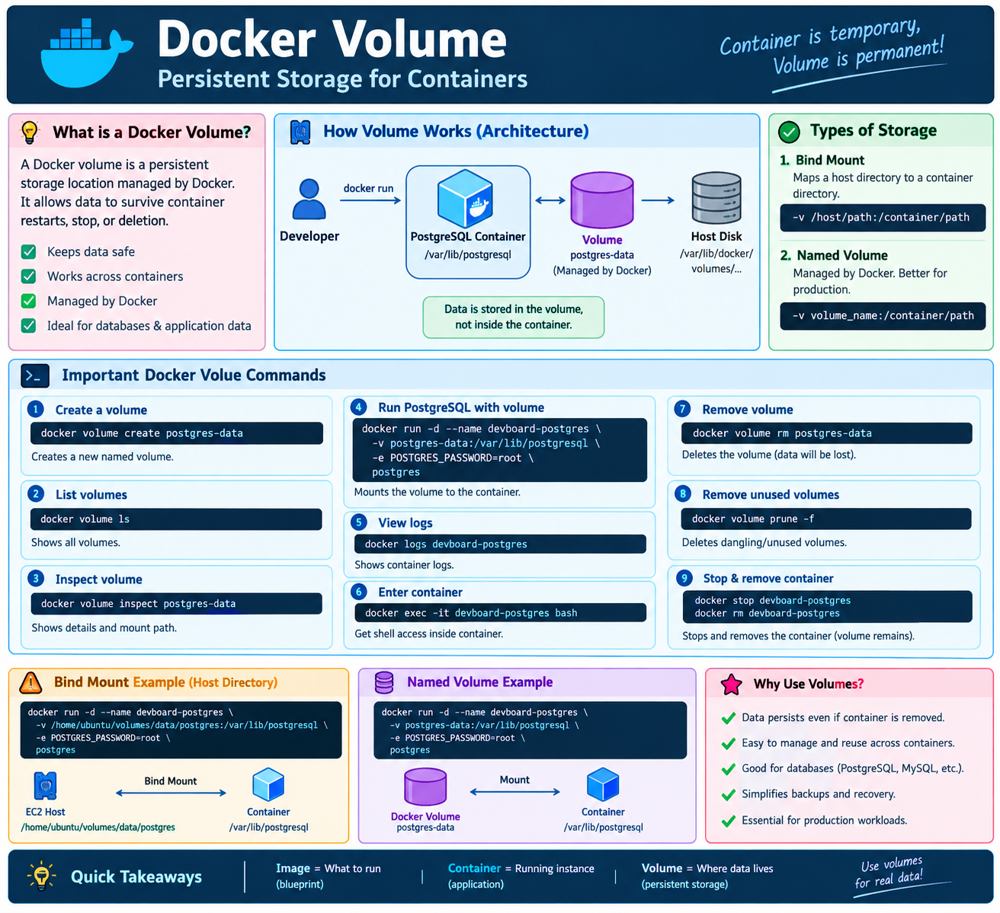
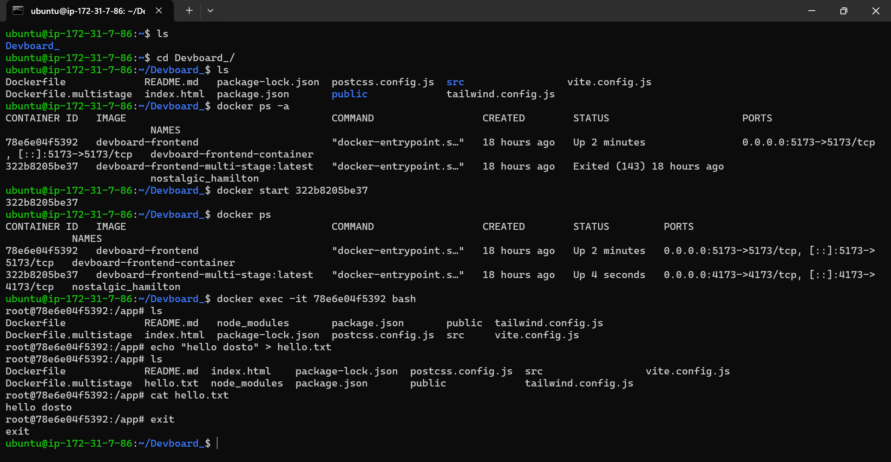
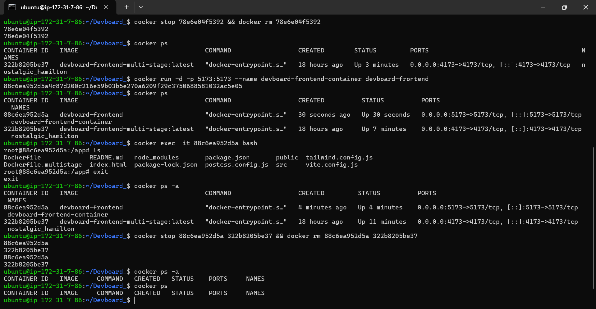
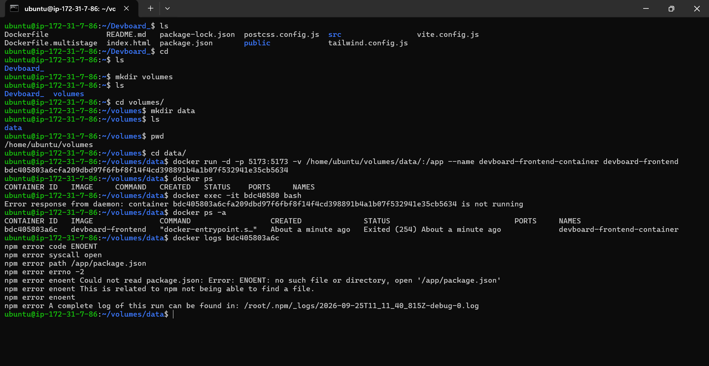
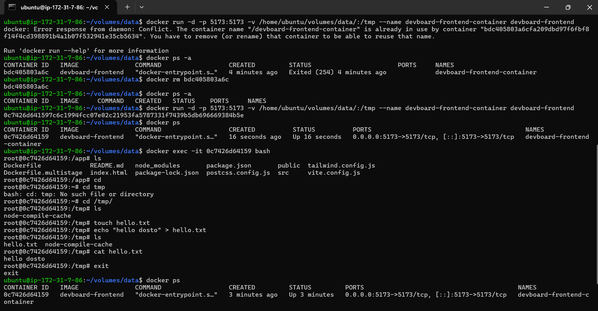
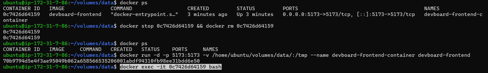
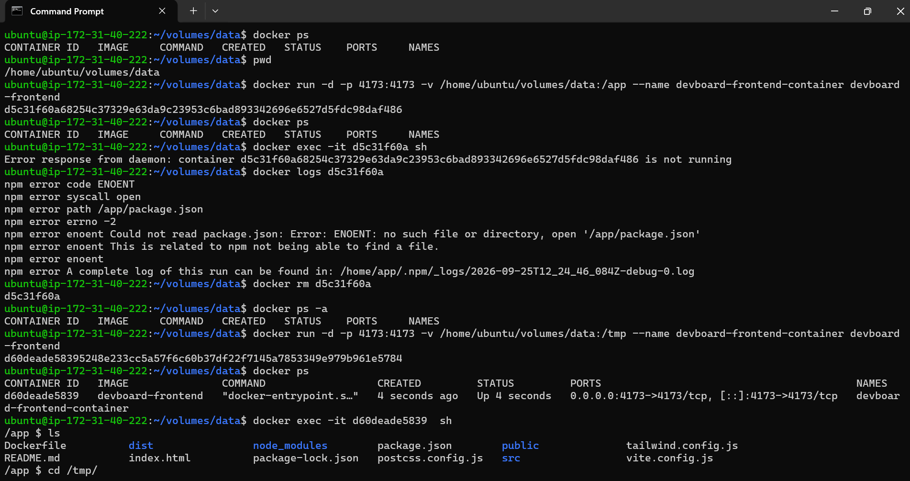
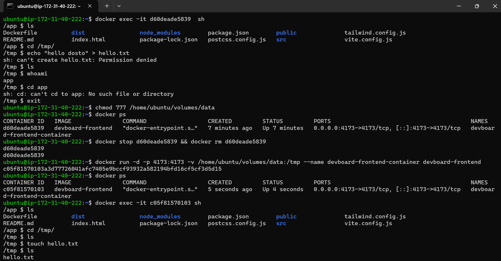
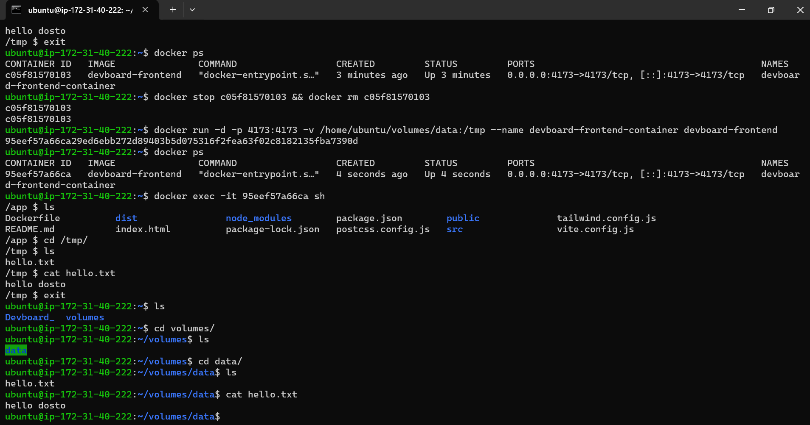
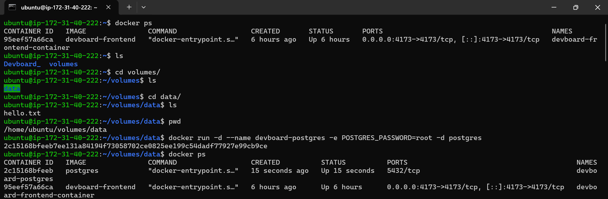
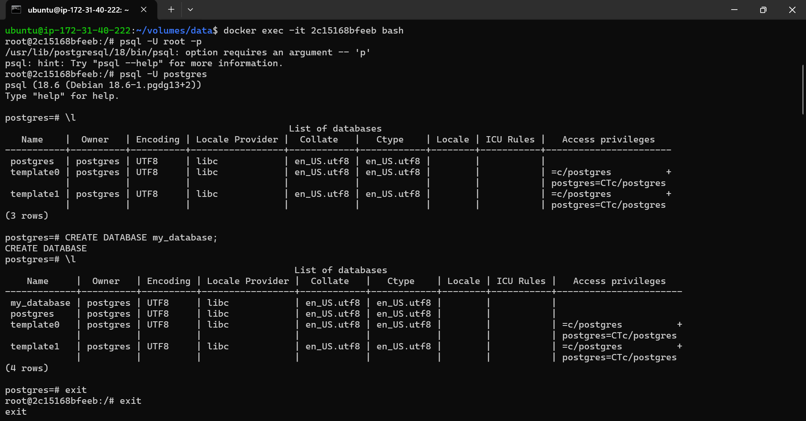
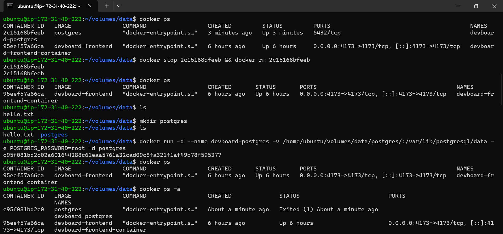
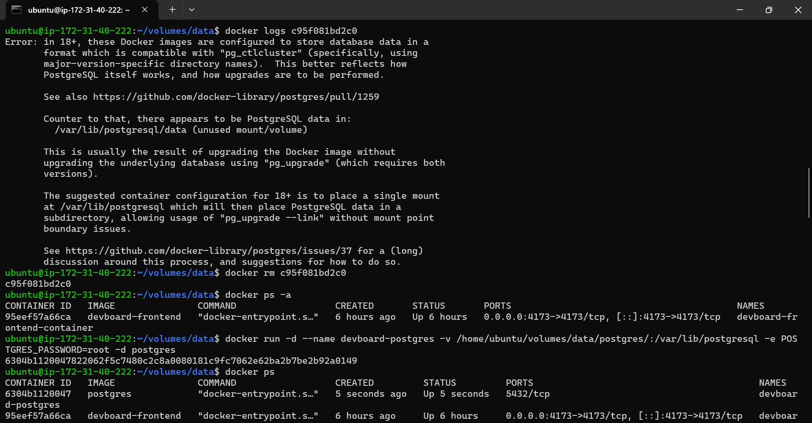
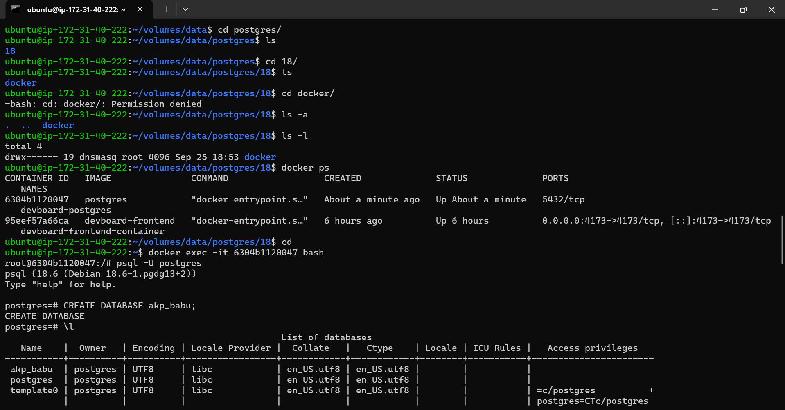
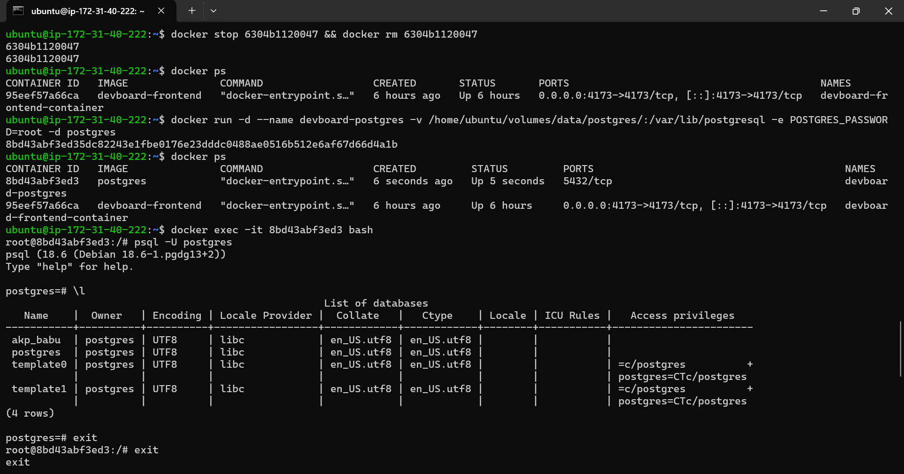
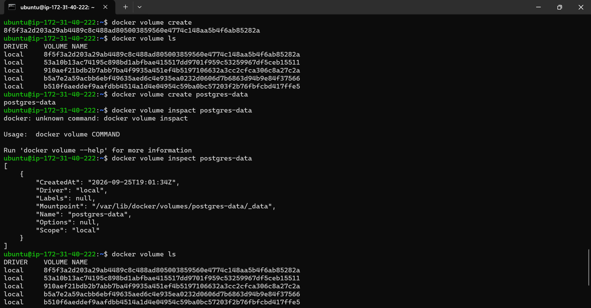
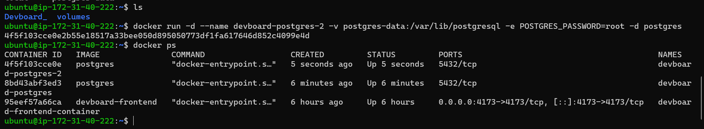

## 1. What is a Docker Volume?

A **Docker volume is persistent storage for containers**.

Normally:

```text
Container
   |
   └── Application/Data
```

If the container is deleted, data stored inside the container can also be lost.

With a volume:

```text
Container
     |
     | mount
     ↓
Docker Volume
     |
     ↓
Persistent Data
```

The important idea is:

> **Container = temporary application environment**
> **Volume = persistent data**

---

# 2. Why Do We Need Volumes?

Suppose PostgreSQL is running inside a container:

```text
PostgreSQL Container
        |
        └── Database
             |
             └── akp_babu
```

If we remove the container:

```bash
docker rm -f devboard-postgres
```

Without persistent storage:

```text
Container deleted
      ↓
Database data may be lost
```

With a volume:

```text
PostgreSQL Container
        |
        ↓
Docker Volume
        |
        ↓
Database files
```

Now:

```bash
docker rm -f devboard-postgres
```

removes only the container.

The volume remains.

A new PostgreSQL container can mount the same volume:

```text
Old Container
      X
      |
      | same volume
      ↓
postgres-data
      ↑
      |
New Container
```

Therefore the database can continue using the existing data.

---

# 3. Three Important Types of Docker Storage

## Type 1 — Container writable layer

Data is stored directly inside the container.

```text
Container
└── /app/data
```

Problem:

```text
docker rm container
        ↓
data can disappear
```

Use mainly for temporary data.

---

# 4. Bind Mount

A **bind mount** connects a specific directory on the host to a directory inside the container.

Your example:

```bash
-v /home/ubuntu/volumes/data/postgres:/var/lib/postgresql
```

Architecture:

```text
EC2 / Ubuntu Host
│
├── /home/ubuntu/volumes/data/postgres
│
│          bind mount
│              │
│              ▼
│       PostgreSQL Container
│       /var/lib/postgresql
│
└── Database files
```

The host controls the exact directory.

### Example

```bash
docker run -d \
  --name devboard-postgres \
  -v /home/ubuntu/volumes/data/postgres:/var/lib/postgresql \
  -e POSTGRES_PASSWORD=root \
  postgres
```

### Meaning

| Part                                 | Meaning                    |
| ------------------------------------ | -------------------------- |
| `docker run`                         | Create and start container |
| `-d`                                 | Detached/background mode   |
| `--name devboard-postgres`           | Container name             |
| `-v`                                 | Mount storage              |
| `/home/ubuntu/volumes/data/postgres` | Host directory             |
| `/var/lib/postgresql`                | Container directory        |
| `-e`                                 | Environment variable       |
| `POSTGRES_PASSWORD=root`             | PostgreSQL password        |
| `postgres`                           | PostgreSQL image           |

---

# 5. Why Your First PostgreSQL Volume Failed

You initially used:

```bash
-v /home/ubuntu/volumes/data/postgres/:/var/lib/postgresql/data
```

PostgreSQL 18 reported an error because the newer PostgreSQL Docker image expects the mount at:

```text
/var/lib/postgresql
```

rather than directly mounting:

```text
/var/lib/postgresql/data
```

For PostgreSQL 18+, your working approach was:

```bash
-v /home/ubuntu/volumes/data/postgres:/var/lib/postgresql
```

Then PostgreSQL created its version-specific structure:

```text
/home/ubuntu/volumes/data/postgres
└── 18
    └── docker
        └── PostgreSQL data
```

This is why you saw:

```bash
ls
18
```

and then:

```bash
18/docker
```

---

# 6. Permission Denied

You executed:

```bash
cd docker/
```

and received:

```text
Permission denied
```

You then saw:

```bash
ls -l
```

showing:

```text
drwx------ 19 dnsmasq root ...
```

This happens because PostgreSQL inside the container created the files using its PostgreSQL user/UID.

The host user `ubuntu` does not necessarily have permission to enter those directories.

This is normal for database storage.

Do not randomly change database directory permissions in production.

---

# 7. Your PostgreSQL Persistence Test

You created:

```bash
docker run -d \
  --name devboard-postgres \
  -v /home/ubuntu/volumes/data/postgres:/var/lib/postgresql \
  -e POSTGRES_PASSWORD=root \
  postgres
```

Then:

```bash
docker exec -it 8bd43abf3ed3 bash
```

Inside:

```bash
psql -U postgres
```

Then:

```sql
CREATE DATABASE akp_babu;
```

Check:

```sql
\l
```

You saw:

```text
akp_babu
postgres
template0
template1
```

Then you removed the container:

```bash
docker stop 8bd43abf3ed3
docker rm 8bd43abf3ed3
```

Then started another container using the same directory:

```bash
docker run -d \
  --name devboard-postgres \
  -v /home/ubuntu/volumes/data/postgres:/var/lib/postgresql \
  -e POSTGRES_PASSWORD=root \
  postgres
```

Then:

```bash
docker exec -it 8bd43abf3ed3 bash
```

and:

```bash
psql -U postgres
```

Then:

```sql
\l
```

still showed:

```text
akp_babu
```

### This proves persistence.

```text
Container 1
    |
    | creates akp_babu
    ↓
Host Bind Mount
    |
    | database files
    ↓
Container 1 deleted
    X
    |
    ↓
Same Host Data
    |
    ↓
Container 2
    |
    ↓
akp_babu still exists
```

---

# 8. Named Docker Volume

Instead of manually specifying:

```text
/home/ubuntu/volumes/data/postgres
```

Docker can manage the storage.

Create a named volume:

```bash
docker volume create postgres-data
```

Check:

```bash
docker volume ls
```

You get:

```text
DRIVER    VOLUME NAME
local     postgres-data
```

---

# 9. Inspect a Named Volume

Correct command:

```bash
docker volume inspect postgres-data
```

You accidentally typed:

```bash
docker volume inspact postgres-data
```

Correct spelling:

```bash
docker volume inspect postgres-data
```

Output contains:

```text
"Driver": "local"
"Mountpoint": "/var/lib/docker/volumes/postgres-data/_data"
"Name": "postgres-data"
```

Important:

```text
postgres-data
       |
       ↓
/var/lib/docker/volumes/postgres-data/_data
```

Docker manages this location.

---

# 10. Run PostgreSQL Using Named Volume

Your command:

```bash
docker run -d \
  --name devboard-postgres-2 \
  -v postgres-data:/var/lib/postgresql \
  -e POSTGRES_PASSWORD=root \
  postgres
```

Architecture:

```text
                 EC2 Ubuntu
                     |
              Docker Engine
                     |
             postgres-data
                     |
                     ↓
          PostgreSQL Container
          /var/lib/postgresql
                     |
                     ↓
                PostgreSQL
```

---

# 11. Bind Mount vs Named Volume

## Bind Mount

```bash
-v /home/ubuntu/data:/var/lib/postgresql
```

You control the host path.

```text
Host directory
      ↓
Container
```

Good for:

* Development
* Configuration files
* Source code
* When you specifically need a host directory

---

## Named Volume

```bash
-v postgres-data:/var/lib/postgresql
```

Docker manages the storage location.

```text
Docker Volume
      ↓
Container
```

Good for:

* Databases
* Persistent application data
* Production Docker deployments
* Easier container replacement

---

# 12. Important Docker Volume Commands

## List volumes

```bash
docker volume ls
```

Meaning:

> Show all Docker volumes.

---

## Create volume

```bash
docker volume create postgres-data
```

Meaning:

> Create a persistent Docker-managed volume.

---

## Inspect volume

```bash
docker volume inspect postgres-data
```

Meaning:

> Show volume configuration and physical mount location.

---

## Remove volume

```bash
docker volume rm postgres-data
```

Important:

> This deletes the volume and can delete the persistent data stored in it.

Be careful with production databases.

---

## Remove unused volumes

```bash
docker volume prune
```

Docker asks for confirmation.

Force:

```bash
docker volume prune -f
```

Be careful because unused volumes can contain data you may still need.

---

# 13. Check Containers

```bash
docker ps
```

Shows running containers.

```bash
docker ps -a
```

Shows:

```text
Running
Stopped
Exited
```

containers.

---

# 14. Check Container Logs

```bash
docker logs devboard-postgres
```

or:

```bash
docker logs <container-id>
```

Example:

```bash
docker logs c95f081bd2c0
```

Very important when a container exits unexpectedly.

---

# 15. Enter a Container

```bash
docker exec -it devboard-postgres bash
```

Meaning:

```text
docker exec
   ↓
execute command inside running container

-it
   ↓
interactive terminal

bash
   ↓
start Bash shell
```

For Alpine images, Bash may not exist.

Use:

```bash
docker exec -it <container> sh
```

---

# 16. PostgreSQL Commands

Enter PostgreSQL container:

```bash
docker exec -it devboard-postgres bash
```

Connect:

```bash
psql -U postgres
```

List databases:

```sql
\l
```

Create database:

```sql
CREATE DATABASE akp_babu;
```

Connect to database:

```sql
\c akp_babu
```

List tables:

```sql
\dt
```

Exit PostgreSQL:

```sql
\q
```

or:

```sql
exit
```

to leave the container shell.

---

# 17. Your `psql -p` Error

You ran:

```bash
psql -U root -p
```

and received:

```text
option requires an argument -- 'p'
```

Why?

Because:

```bash
-p
```

means:

```text
port
```

It expects a port number.

Example:

```bash
psql -U postgres -p 5432
```

But the default PostgreSQL port is already:

```text
5432
```

so this is enough:

```bash
psql -U postgres
```

---

# 18. PostgreSQL Port

PostgreSQL normally listens on:

```text
5432
```

Your:

```bash
docker ps
```

showed:

```text
5432/tcp
```

This means the port exists inside the Docker network/container, but you did NOT publish it to the EC2 host.

You did not use:

```bash
-p 5432:5432
```

Therefore PostgreSQL is not directly exposed through the EC2 public IP.

This is generally preferable for a database.

---

# 19. If You Need Host Port 5432

Example:

```bash
docker run -d \
  --name devboard-postgres \
  -p 5432:5432 \
  -v postgres-data:/var/lib/postgresql \
  -e POSTGRES_PASSWORD=root \
  postgres
```

Architecture:

```text
Internet
   |
   ↓
EC2 :5432
   |
   ↓
Docker :5432
   |
   ↓
PostgreSQL
```

However, **do not expose PostgreSQL publicly unless there is a specific security requirement**.

For a production architecture, prefer:

```text
Application
     |
     ↓
Private Network
     |
     ↓
Database
```

and restrict access using security groups/firewalls/network policy.

---

# 20. Docker Volume Visualization

## Basic Concept

```text
                  DOCKER HOST
              Ubuntu / EC2 Server
                       |
             +---------+---------+
             |                   |
             ↓                   ↓
       Frontend Container   PostgreSQL Container
             |                   |
             |                   |
          App files         Database files
                                 |
                                 ↓
                         Docker Volume
                         postgres-data
                                 |
                                 ↓
                      Persistent Storage
```

---

# 21. Container Without Volume

```text
             PostgreSQL Container
             ┌──────────────────┐
             │ PostgreSQL       │
             │                  │
             │ akp_babu         │
             │ data              │
             └──────────────────┘
                      |
                      X
               Container deleted
                      |
                      ↓
                 Data lost
```

---

# 22. Container With Volume

```text
             PostgreSQL Container
             ┌──────────────────┐
             │ PostgreSQL       │
             │                  │
             └────────┬─────────┘
                      │
                      │ mount
                      ↓
              ┌───────────────┐
              │ postgres-data │
              │               │
              │ akp_babu      │
              │ DB files      │
              └───────────────┘

Container deleted
      ↓
Volume remains
      ↓
New container
      ↓
Same database
```

---

# 23. Production Devboard Architecture

A simple Docker production architecture:

```text
                         INTERNET
                            |
                            ↓
                    ┌─────────────┐
                    │    EC2      │
                    │   Server    │
                    └──────┬──────┘
                           |
                  ┌────────┴────────┐
                  ↓                 ↓
          Frontend Container   Backend Container
          Vite/Nginx           API
                  |                 |
                  |                 |
                  └────────┬────────┘
                           |
                           ↓
                  PostgreSQL Database
                           |
                           ↓
                    Persistent Storage
                     postgres-data
```

---

# 24. Better Production Architecture

For a real AWS production system, a better architecture is:

```text
                       Internet
                           |
                           ↓
                    Load Balancer
                           |
                           ↓
                  Frontend / Backend
                    Containers
                           |
                           ↓
                    Private Network
                           |
                           ↓
                    PostgreSQL
                           |
                           ↓
                    Managed Database
                         / RDS
```

Instead of keeping your production PostgreSQL database on an EC2 Docker volume:

```text
EC2
 |
 └── PostgreSQL Container
       |
       └── Docker Volume
```

a common production approach is:

```text
Application Containers
        |
        ↓
AWS RDS PostgreSQL
        |
        ↓
AWS-managed storage,
backup and recovery
```

Docker volumes are still very useful for Docker-based applications and self-managed databases, but a managed database service reduces the operational work around backups, upgrades, recovery, and storage management.

---

# 25. Docker Volume Data Flow

```text
Developer
    |
    ↓
docker run
    |
    ↓
PostgreSQL Container
    |
    | writes
    ↓
postgres-data volume
    |
    | persists
    ↓
Disk
```

When container stops:

```text
Container STOP
      |
      ↓
Volume remains
```

When container is deleted:

```text
Container DELETE
      |
      ↓
Volume remains
```

When volume is deleted:

```text
docker volume rm postgres-data
      |
      ↓
Persistent data may be deleted
```

---

# 26. Important Difference: Image vs Container vs Volume

```text
                 Docker
                   |
        +----------+----------+
        |          |          |
        ↓          ↓          ↓
      Image    Container    Volume
        |          |          |
     Template    Running     Data
     /Package    Process     Storage
```

### Image

```text
postgres:latest
```

Contains the software required to create a PostgreSQL container.

### Container

```text
devboard-postgres
```

A running instance of the image.

### Volume

```text
postgres-data
```

Persistent storage for the database.

---

# 27. Easy Memory Trick

Remember:

```text
IMAGE     = Blueprint
CONTAINER = Running Application
VOLUME    = Persistent Data
```

Example:

```text
postgres image
      ↓
postgres container
      ↓
postgres-data volume
```

---

# 28. Important Commands — Quick Revision

```bash
# Containers
docker ps
docker ps -a

# Images
docker images

# Start PostgreSQL
docker run -d --name devboard-postgres \
  -e POSTGRES_PASSWORD=root \
  postgres

# Create volume
docker volume create postgres-data

# List volumes
docker volume ls

# Inspect volume
docker volume inspect postgres-data

# PostgreSQL with named volume
docker run -d \
  --name devboard-postgres \
  -v postgres-data:/var/lib/postgresql \
  -e POSTGRES_PASSWORD=root \
  postgres

# Logs
docker logs devboard-postgres

# Enter container
docker exec -it devboard-postgres bash

# PostgreSQL shell
psql -U postgres

# Stop
docker stop devboard-postgres

# Remove container
docker rm devboard-postgres

# Remove volume
docker volume rm postgres-data

# Remove unused volumes
docker volume prune
```

---

# 29. Bind Mount Quick Revision

```bash
docker run -d \
  --name devboard-postgres \
  -v /home/ubuntu/volumes/data/postgres:/var/lib/postgresql \
  -e POSTGRES_PASSWORD=root \
  postgres
```

Remember:

```text
-v HOST_PATH:CONTAINER_PATH
```

Example:

```text
-v /home/ubuntu/data:/var/lib/postgresql
       │                     │
       │                     └── Container
       └── Host
```

---

# 30. Named Volume Quick Revision

```bash
docker volume create postgres-data
```

Then:

```bash
docker run -d \
  --name devboard-postgres \
  -v postgres-data:/var/lib/postgresql \
  -e POSTGRES_PASSWORD=root \
  postgres
```

Remember:

```text
-v VOLUME_NAME:CONTAINER_PATH
```

Example:

```text
-v postgres-data:/var/lib/postgresql
      │                    │
      │                    └── Container
      └── Docker Volume
```

---

# 31. Production Rules

### Rule 1

Do not store important database data only inside the container.

### Rule 2

Use persistent storage.

```text
Container + Volume
```

### Rule 3

Protect database credentials.

Avoid putting production passwords directly in commands, shell history, or Git repositories.

### Rule 4

Do not expose PostgreSQL publicly without a security requirement.

### Rule 5

Backups are different from volumes.

A volume provides persistence:

```text
Container deleted
       ↓
Data remains
```

A backup provides recovery:

```text
Database damaged/deleted
       ↓
Restore from backup
```

Therefore:

```text
Volume ≠ Backup
```

Production databases should have a backup/recovery strategy.

---

# 32. Final Interview Answer

### What is a Docker volume?

> A Docker volume is persistent storage managed by Docker. It allows application data, such as PostgreSQL database files, to survive container deletion or replacement.

### Why use volumes?

> Containers are designed to be replaceable, while database data needs to persist. A volume separates persistent data from the container lifecycle.

### Bind mount vs named volume?

> A bind mount maps a specific host directory to a container directory, while a named volume is managed by Docker and is generally easier to manage for persistent application data.

### Does deleting a container delete its named volume?

Normally:

```bash
docker rm container
```

does **not** remove the named volume.

The volume must be removed separately:

```bash
docker volume rm postgres-data
```

### Is a volume a backup?

> No. A volume provides persistent storage, but production systems still need backups and recovery mechanisms.

---

# 33. Complete Mental Model

```text
                 DOCKER
                    |
       +------------+------------+
       |            |            |
       ↓            ↓            ↓
     IMAGE      CONTAINER      VOLUME
       |            |            |
   Blueprint     Runtime       Storage
       |            |            |
       ↓            ↓            ↓
  postgres      PostgreSQL    Database
    image       container       data
                                  |
                                  ↓
                              Persistence
```

## One-line revision

```text
IMAGE = What to run
CONTAINER = Running instance
VOLUME = Where persistent data lives
```

## Devboard example

```text
devboard-frontend image
        ↓
frontend container
        ↓
port 4173

postgres image
        ↓
postgres container
        ↓
postgres-data volume
        ↓
PostgreSQL database
        ↓
Persistent data
```
