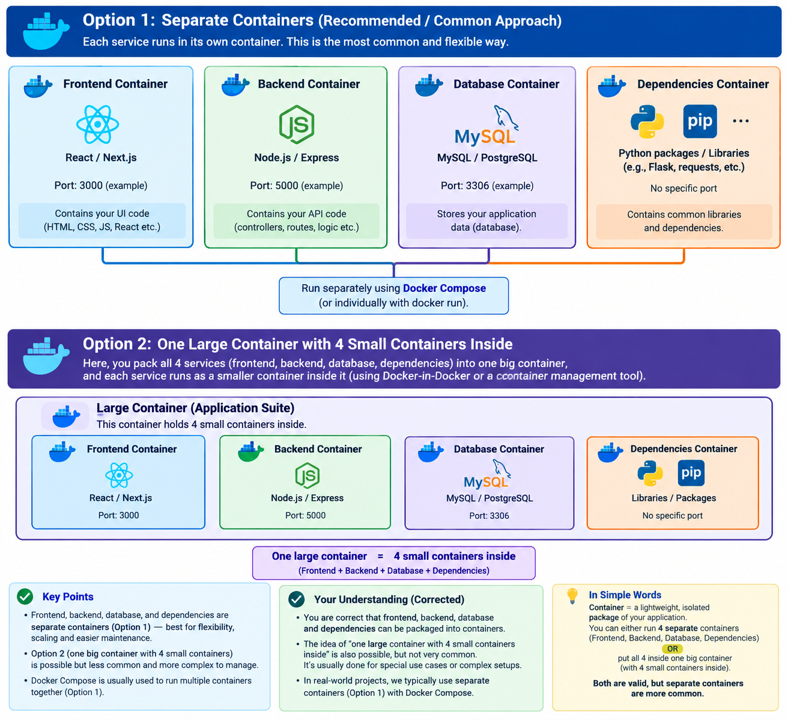
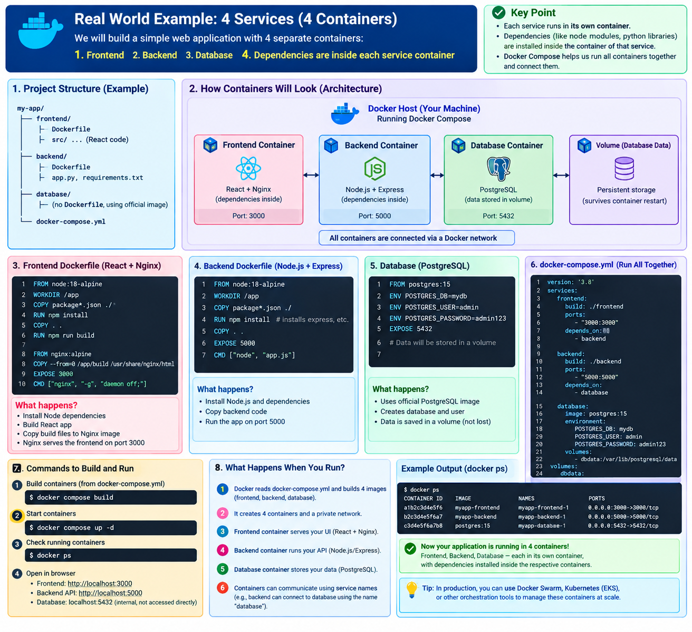
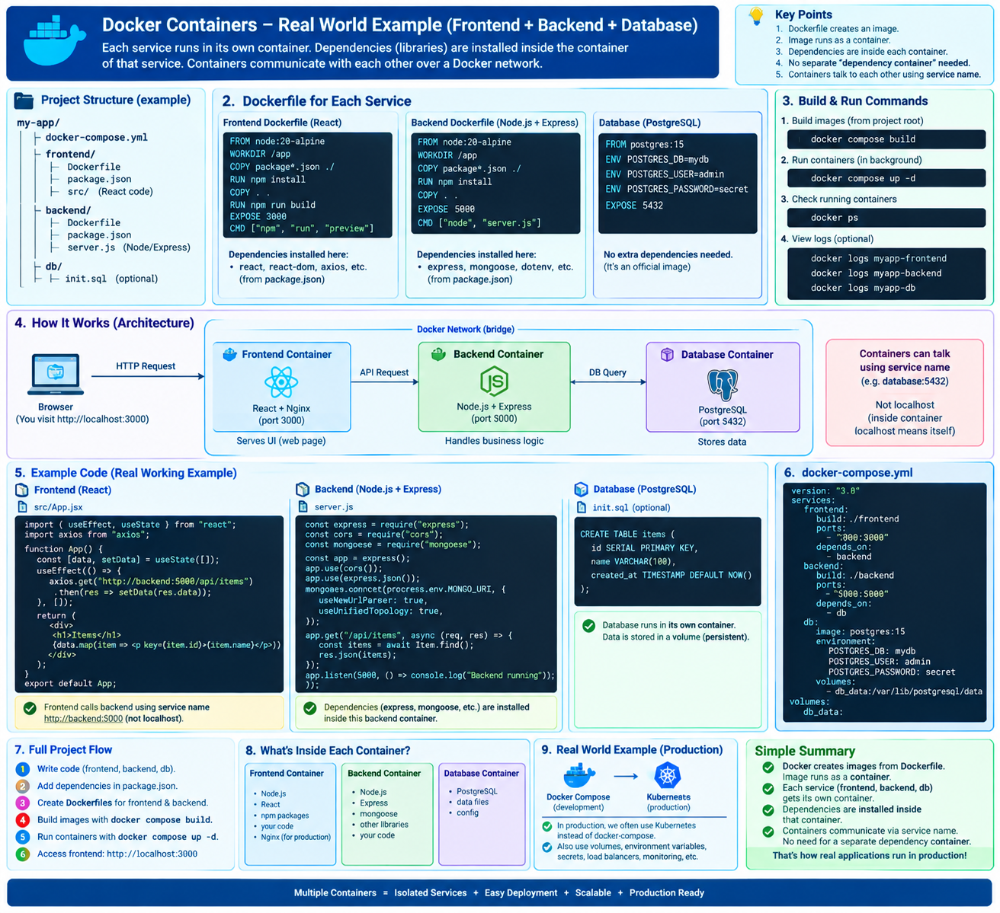

# 🐳 Virtual Machines vs Containers — Complete Notes

## 📌 Important Correction

A common statement is:

> "A container is running its own operating system."

This is **not quite correct**.

A container has its own **user-space environment**, including:

* Application
* Files
* Libraries
* Binaries
* Dependencies
* Configuration

However, a container does **not** have its own complete guest operating system or its own kernel like a Virtual Machine.

### Memory Trick

```text
VM = Application + Dependencies + Full Guest OS

Container = Application + Dependencies + Shared Host Kernel
```

---

# 1. 🖥️ Virtualization — Virtual Machines

Think of virtualization like **separate apartments**.

```text
PHYSICAL MACHINE
│
├── Host OS: Windows / Linux / macOS
│
└── Hypervisor
     │
     ├── 🏠 VM 1
     │    ├── Guest OS: Linux
     │    ├── Application
     │    ├── Libraries
     │    └── Dependencies
     │
     └── 🏠 VM 2
          ├── Guest OS: Linux
          ├── Application
          ├── Libraries
          └── Dependencies
```

Each VM contains a **complete guest operating system**.

A simplified VM model is:

```text
VM
│
├── Application
├── Libraries
├── Dependencies
├── Guest OS
└── Virtual Hardware
```

Because every VM includes a guest OS and virtual hardware, VMs generally require more resources than containers.

### VM Formula

```text
VM = Application
   + Libraries
   + Dependencies
   + Guest OS
   + Virtual Hardware
```

---

# 2. 🐳 Containerization

Containerization is different.

Think of containers as **apartments sharing the building infrastructure**.

```text
PHYSICAL MACHINE
│
└── Host OS
     │
     ├── Linux Kernel  ← SHARED
     │
     └── Container Runtime
          │
          ├── 📦 Frontend Container
          │    ├── Frontend application
          │    ├── React
          │    ├── Node libraries
          │    └── Other dependencies
          │
          ├── 📦 Backend Container
          │    ├── Backend application
          │    ├── Python / Node
          │    ├── Backend libraries
          │    └── Other dependencies
          │
          ├── 📦 Nginx Container
          │    └── Nginx
          │
          └── 📦 Database Container
               └── MongoDB / MySQL
```

Notice the important difference:

> There is **no separate guest OS inside every container**.

---

# 3. ❌ Wrong Container Mental Model

A common misunderstanding is:

```text
Container
    ↓
Ubuntu OS
    ↓
Linux Kernel
```

This makes containers look like lightweight VMs.

That is not the correct model.

---

# 4. ✅ Correct Container Mental Model

A better model is:

```text
Backend Container
       ↓
Python + Python Libraries
       ↓
Shared Linux Kernel
```

The container provides the application's **user-space environment**, while the kernel is provided by the underlying host operating system.

---

# 5. 📚 Why Does Every Container Have Its Own Libraries?

This is an important question.

Different applications may require completely different software versions.

For example:

### Frontend

```text
Node.js 22
React
npm packages
Frontend dependencies
```

### Backend

```text
Python 3.12
Django
Requests
Python packages
Backend dependencies
```

These applications should not need to use exactly the same application libraries.

Docker allows each container to have its own **user-space filesystem and dependencies**.

For example:

```text
                    SHARED
                 Linux Kernel
                      │
          ┌───────────┼───────────┐
          ↓           ↓           ↓
      Frontend     Backend      Nginx
      Container    Container   Container
          │           │           │
        React       Python       Nginx
        Node        Django
        npm libs    pip libs
```

### Important Point

```text
Shared Kernel
      ≠
Shared Application Libraries
```

Containers can have separate:

* Applications
* Libraries
* Binaries
* Package versions
* Configuration
* Filesystems

while sharing the underlying kernel.

---

# 6. 🏢 Apartment Building Analogy

The apartment analogy can help explain the difference.

## VM

Imagine every apartment has its own complete infrastructure:

```text
Apartment 1
├── Kitchen
├── Bathroom
├── Inverter
├── Water system
└── Complete infrastructure

Apartment 2
├── Kitchen
├── Bathroom
├── Inverter
├── Water system
└── Complete infrastructure
```

This is similar to VMs having:

```text
Guest OS
Virtual CPU
Virtual RAM
Virtual Disk
Drivers
Libraries
Application
```

Each VM is relatively self-contained.

---

# 7. 🐳 Containers — Shared Building Infrastructure

Now imagine an apartment building where the major infrastructure is shared:

```text
                🏢 BUILDING
        ┌─────────────────────────┐
        │ Shared Infrastructure   │
        │                         │
        │ Shared Foundation       │
        │ Shared Main Systems     │
        │                         │
        │  ┌──────┐   ┌──────┐   │
        │  │ App1 │   │ App2 │   │
        │  └──────┘   └──────┘   │
        └─────────────────────────┘
```

Similarly:

```text
Container 1 → Own application + libraries
Container 2 → Own application + libraries
Container 3 → Own application + libraries

                    ↓

             Shared Host Kernel
```

The containers have their own user-space environments, but the kernel is shared.

---

# 8. 🌐 Understanding Nginx

Another common area of confusion is Nginx.

Suppose you have an application architecture like:

```text
User
 │
 │ HTTP Request
 ↓
Nginx
 │
 ↓
Backend API
 │
 ↓
Database
```

Nginx is commonly used as a **reverse proxy**.

For example, the user requests:

```text
https://example.com/api/users
```

Nginx receives the request.

It can determine that:

```text
/api/*
```

should be forwarded to the backend service.

The request can then become:

```text
User
  │
  │ GET /api/users
  ↓
Nginx
  │
  │ HTTP Request
  ↓
Backend Container
  │
  │ Database Request
  ↓
Database Container
```

---

# 9. 🔌 Does Nginx Directly Connect Containers?

Not exactly.

Nginx is responsible for **proxying requests**.

The container runtime/network provides the underlying network connectivity between containers.

For example, Docker can create a network:

```text
                 Docker Network
                       │
        ┌──────────────┼──────────────┐
        │              │              │
        ↓              ↓              ↓
      Nginx          Backend       Database
      :80             :5000         :27017
```

Containers attached to the same Docker network can communicate with each other.

For example:

```text
http://backend:5000
```

Here:

```text
backend
```

can resolve to the backend service/container through Docker's internal DNS/networking.

---

# 10. 🚀 Complete MERN Application Example

Imagine a MERN application:

```text
                         🌍 INTERNET
                              │
                              ↓
                      ┌─────────────┐
                      │    Nginx    │
                      │  Container  │
                      └──────┬──────┘
                             │
                      Docker Network
                             │
                ┌────────────┴────────────┐
                ↓                         ↓
       ┌────────────────┐        ┌────────────────┐
       │    Frontend    │        │    Backend     │
       │    Container   │        │    Container   │
       │                │        │                │
       │ React          │        │ Node/Express   │
       │ JS Libraries   │        │ npm Packages   │
       └────────────────┘        └───────┬────────┘
                                         │
                                         ↓
                                ┌────────────────┐
                                │    MongoDB     │
                                │    Container   │
                                └────────────────┘
```

---

# 11. 🔄 Application Request Flow

A typical request can flow like this:

```text
Browser
   ↓
Nginx
   ↓
Frontend
   ↓
Backend API
   ↓
MongoDB
```

For an API request:

```text
Browser
   ↓
Nginx
   ↓
Backend
   ↓
MongoDB
   ↑
Backend
   ↑
Nginx
   ↑
Browser
```

The exact request flow depends on the application's architecture.

---

# 12. 🧩 VM vs Container

| Feature            | Virtual Machine             | Container               |
| ------------------ | --------------------------- | ----------------------- |
| Application        | ✅                           | ✅                       |
| Libraries          | ✅                           | ✅                       |
| Dependencies       | ✅                           | ✅                       |
| Own filesystem     | ✅                           | ✅                       |
| Guest OS           | ✅                           | ❌                       |
| Separate kernel    | ✅                           | ❌                       |
| Host kernel shared | ❌                           | ✅                       |
| Isolation          | Stronger isolation boundary | Process-level isolation |
| Resource usage     | Generally higher            | Generally lower         |
| Startup            | Generally slower            | Generally faster        |

> **Note:** Containers are not simply "VMs without an OS." They use OS-level isolation mechanisms such as namespaces and cgroups, and their isolation characteristics differ from VMs.

---

# 13. 🧠 The Most Important Difference

### Virtual Machine

```text
Host OS
   ↓
Hypervisor
   ↓
┌───────────────────────┐
│ Guest OS + Application│
└───────────────────────┘

┌───────────────────────┐
│ Guest OS + Application│
└───────────────────────┘
```

Each VM has its own guest operating system.

---

### Containers

```text
Host OS
   ↓
Shared Kernel
   ↓
Container Runtime
   ↓
┌─────────────────────────┐
│ Frontend + Dependencies │
├─────────────────────────┤
│ Backend + Dependencies  │
├─────────────────────────┤
│ Nginx                   │
├─────────────────────────┤
│ Database                │
└─────────────────────────┘
```

The containers share the underlying kernel.

---

# 14. 🧠 One-Line Memory Trick

Remember:

```text
VM = App + Dependencies + Full Guest OS
```

```text
Container = App + Dependencies + Shared Host Kernel
```

---

# 15. 🔗 Nginx + Docker Network Mental Model

The key idea is:

```text
Nginx
  │
  │ Reverse Proxy
  ↓
Backend
  │
  │ Application connection
  ↓
Database
```

While Docker provides the network:

```text
             Docker Network
                    │
        ┌───────────┼───────────┐
        ↓           ↓           ↓
      Nginx       Backend    Database
```

Therefore:

> **Nginx does not magically connect containers. Nginx acts as a reverse proxy, while the container network provides connectivity between services.**

---

# 16. 🎯 Final Mental Model

### Virtualization

```text
Physical Machine
      ↓
   Host OS
      ↓
  Hypervisor
      ↓
┌───────────────┐
│ VM 1          │
│ Guest OS      │
│ Application   │
└───────────────┘

┌───────────────┐
│ VM 2          │
│ Guest OS      │
│ Application   │
└───────────────┘
```

### Containerization

```text
Physical Machine
      ↓
   Host OS
      ↓
 Shared Kernel
      ↓
Container Runtime
      ↓
┌─────────────────────┐
│ Frontend            │
│ + Dependencies      │
├─────────────────────┤
│ Backend             │
│ + Dependencies      │
├─────────────────────┤
│ Nginx               │
├─────────────────────┤
│ Database            │
└─────────────────────┘
      ↓
 Docker Network
      ↓
Nginx → Backend → Database
```

---

# ✅ Final Takeaway

The biggest correction is:

> **Containers do have their own applications, files, libraries, binaries, and dependencies, but they do not contain a complete guest operating system and normally do not have their own kernel.**

The easiest way to remember the difference:

```text
VM
│
├── Application
├── Libraries
├── Dependencies
├── Guest OS
└── Virtual Hardware

Container
│
├── Application
├── Libraries
├── Dependencies
└── Shared Host Kernel
```

And for a Dockerized application:

```text
Internet
   ↓
Nginx
   ↓
Docker Network
   ↓
Backend
   ↓
Database
```

**VMs virtualize machines.
Containers isolate applications/processes while sharing the host kernel.**


.....................................................................................................................................................................................


# 🐳 Virtual Machines vs Containers — Complete Notes

## 📌 Important Correction

A common statement is:

> "A container is running its own operating system."

This is **not quite correct**.

A container has its own **user-space environment**, including:

* Application
* Files
* Libraries
* Binaries
* Dependencies
* Configuration

However, a container does **not** have its own complete guest operating system or its own kernel like a Virtual Machine.

### Memory Trick

```text
VM = Application + Dependencies + Full Guest OS

Container = Application + Dependencies + Shared Host Kernel
```

---

# 1. 🖥️ Virtualization — Virtual Machines

Think of virtualization like **separate apartments**.

```text
PHYSICAL MACHINE
│
├── Host OS: Windows / Linux / macOS
│
└── Hypervisor
     │
     ├── 🏠 VM 1
     │    ├── Guest OS: Linux
     │    ├── Application
     │    ├── Libraries
     │    └── Dependencies
     │
     └── 🏠 VM 2
          ├── Guest OS: Linux
          ├── Application
          ├── Libraries
          └── Dependencies
```

Each VM contains a **complete guest operating system**.

A simplified VM model is:

```text
VM
│
├── Application
├── Libraries
├── Dependencies
├── Guest OS
└── Virtual Hardware
```

Because every VM includes a guest OS and virtual hardware, VMs generally require more resources than containers.

### VM Formula

```text
VM = Application
   + Libraries
   + Dependencies
   + Guest OS
   + Virtual Hardware
```

---

# 2. 🐳 Containerization

Containerization is different.

Think of containers as **apartments sharing the building infrastructure**.

```text
PHYSICAL MACHINE
│
└── Host OS
     │
     ├── Linux Kernel  ← SHARED
     │
     └── Container Runtime
          │
          ├── 📦 Frontend Container
          │    ├── Frontend application
          │    ├── React
          │    ├── Node libraries
          │    └── Other dependencies
          │
          ├── 📦 Backend Container
          │    ├── Backend application
          │    ├── Python / Node
          │    ├── Backend libraries
          │    └── Other dependencies
          │
          ├── 📦 Nginx Container
          │    └── Nginx
          │
          └── 📦 Database Container
               └── MongoDB / MySQL
```

Notice the important difference:

> There is **no separate guest OS inside every container**.

---

# 3. ❌ Wrong Container Mental Model

A common misunderstanding is:

```text
Container
    ↓
Ubuntu OS
    ↓
Linux Kernel
```

This makes containers look like lightweight VMs.

That is not the correct model.

---

# 4. ✅ Correct Container Mental Model

A better model is:

```text
Backend Container
       ↓
Python + Python Libraries
       ↓
Shared Linux Kernel
```

The container provides the application's **user-space environment**, while the kernel is provided by the underlying host operating system.

---

# 5. 📚 Why Does Every Container Have Its Own Libraries?

This is an important question.

Different applications may require completely different software versions.

For example:

### Frontend

```text
Node.js 22
React
npm packages
Frontend dependencies
```

### Backend

```text
Python 3.12
Django
Requests
Python packages
Backend dependencies
```

These applications should not need to use exactly the same application libraries.

Docker allows each container to have its own **user-space filesystem and dependencies**.

For example:

```text
                    SHARED
                 Linux Kernel
                      │
          ┌───────────┼───────────┐
          ↓           ↓           ↓
      Frontend     Backend      Nginx
      Container    Container   Container
          │           │           │
        React       Python       Nginx
        Node        Django
        npm libs    pip libs
```

### Important Point

```text
Shared Kernel
      ≠
Shared Application Libraries
```

Containers can have separate:

* Applications
* Libraries
* Binaries
* Package versions
* Configuration
* Filesystems

while sharing the underlying kernel.

---

# 6. 🏢 Apartment Building Analogy

The apartment analogy can help explain the difference.

## VM

Imagine every apartment has its own complete infrastructure:

```text
Apartment 1
├── Kitchen
├── Bathroom
├── Inverter
├── Water system
└── Complete infrastructure

Apartment 2
├── Kitchen
├── Bathroom
├── Inverter
├── Water system
└── Complete infrastructure
```

This is similar to VMs having:

```text
Guest OS
Virtual CPU
Virtual RAM
Virtual Disk
Drivers
Libraries
Application
```

Each VM is relatively self-contained.

---

# 7. 🐳 Containers — Shared Building Infrastructure

Now imagine an apartment building where the major infrastructure is shared:

```text
                🏢 BUILDING
        ┌─────────────────────────┐
        │ Shared Infrastructure   │
        │                         │
        │ Shared Foundation       │
        │ Shared Main Systems     │
        │                         │
        │  ┌──────┐   ┌──────┐   │
        │  │ App1 │   │ App2 │   │
        │  └──────┘   └──────┘   │
        └─────────────────────────┘
```

Similarly:

```text
Container 1 → Own application + libraries
Container 2 → Own application + libraries
Container 3 → Own application + libraries

                    ↓

             Shared Host Kernel
```

The containers have their own user-space environments, but the kernel is shared.

---

# 8. 🌐 Understanding Nginx

Another common area of confusion is Nginx.

Suppose you have an application architecture like:

```text
User
 │
 │ HTTP Request
 ↓
Nginx
 │
 ↓
Backend API
 │
 ↓
Database
```

Nginx is commonly used as a **reverse proxy**.

For example, the user requests:

```text
https://example.com/api/users
```

Nginx receives the request.

It can determine that:

```text
/api/*
```

should be forwarded to the backend service.

The request can then become:

```text
User
  │
  │ GET /api/users
  ↓
Nginx
  │
  │ HTTP Request
  ↓
Backend Container
  │
  │ Database Request
  ↓
Database Container
```

---

# 9. 🔌 Does Nginx Directly Connect Containers?

Not exactly.

Nginx is responsible for **proxying requests**.

The container runtime/network provides the underlying network connectivity between containers.

For example, Docker can create a network:

```text
                 Docker Network
                       │
        ┌──────────────┼──────────────┐
        │              │              │
        ↓              ↓              ↓
      Nginx          Backend       Database
      :80             :5000         :27017
```

Containers attached to the same Docker network can communicate with each other.

For example:

```text
http://backend:5000
```

Here:

```text
backend
```

can resolve to the backend service/container through Docker's internal DNS/networking.

---

# 10. 🚀 Complete MERN Application Example

Imagine a MERN application:

```text
                         🌍 INTERNET
                              │
                              ↓
                      ┌─────────────┐
                      │    Nginx    │
                      │  Container  │
                      └──────┬──────┘
                             │
                      Docker Network
                             │
                ┌────────────┴────────────┐
                ↓                         ↓
       ┌────────────────┐        ┌────────────────┐
       │    Frontend    │        │    Backend     │
       │    Container   │        │    Container   │
       │                │        │                │
       │ React          │        │ Node/Express   │
       │ JS Libraries   │        │ npm Packages   │
       └────────────────┘        └───────┬────────┘
                                         │
                                         ↓
                                ┌────────────────┐
                                │    MongoDB     │
                                │    Container   │
                                └────────────────┘
```

---

# 11. 🔄 Application Request Flow

A typical request can flow like this:

```text
Browser
   ↓
Nginx
   ↓
Frontend
   ↓
Backend API
   ↓
MongoDB
```

For an API request:

```text
Browser
   ↓
Nginx
   ↓
Backend
   ↓
MongoDB
   ↑
Backend
   ↑
Nginx
   ↑
Browser
```

The exact request flow depends on the application's architecture.

---

# 12. 🧩 VM vs Container

| Feature            | Virtual Machine             | Container               |
| ------------------ | --------------------------- | ----------------------- |
| Application        | ✅                           | ✅                       |
| Libraries          | ✅                           | ✅                       |
| Dependencies       | ✅                           | ✅                       |
| Own filesystem     | ✅                           | ✅                       |
| Guest OS           | ✅                           | ❌                       |
| Separate kernel    | ✅                           | ❌                       |
| Host kernel shared | ❌                           | ✅                       |
| Isolation          | Stronger isolation boundary | Process-level isolation |
| Resource usage     | Generally higher            | Generally lower         |
| Startup            | Generally slower            | Generally faster        |

> **Note:** Containers are not simply "VMs without an OS." They use OS-level isolation mechanisms such as namespaces and cgroups, and their isolation characteristics differ from VMs.

---

# 13. 🧠 The Most Important Difference

### Virtual Machine

```text
Host OS
   ↓
Hypervisor
   ↓
┌───────────────────────┐
│ Guest OS + Application│
└───────────────────────┘

┌───────────────────────┐
│ Guest OS + Application│
└───────────────────────┘
```

Each VM has its own guest operating system.

---

### Containers

```text
Host OS
   ↓
Shared Kernel
   ↓
Container Runtime
   ↓
┌─────────────────────────┐
│ Frontend + Dependencies │
├─────────────────────────┤
│ Backend + Dependencies  │
├─────────────────────────┤
│ Nginx                   │
├─────────────────────────┤
│ Database                │
└─────────────────────────┘
```

The containers share the underlying kernel.

---

# 14. 🧠 One-Line Memory Trick

Remember:

```text
VM = App + Dependencies + Full Guest OS
```

```text
Container = App + Dependencies + Shared Host Kernel
```

---

# 15. 🔗 Nginx + Docker Network Mental Model

The key idea is:

```text
Nginx
  │
  │ Reverse Proxy
  ↓
Backend
  │
  │ Application connection
  ↓
Database
```

While Docker provides the network:

```text
             Docker Network
                    │
        ┌───────────┼───────────┐
        ↓           ↓           ↓
      Nginx       Backend    Database
```

Therefore:

> **Nginx does not magically connect containers. Nginx acts as a reverse proxy, while the container network provides connectivity between services.**

---

# 16. 🎯 Final Mental Model

### Virtualization

```text
Physical Machine
      ↓
   Host OS
      ↓
  Hypervisor
      ↓
┌───────────────┐
│ VM 1          │
│ Guest OS      │
│ Application   │
└───────────────┘

┌───────────────┐
│ VM 2          │
│ Guest OS      │
│ Application   │
└───────────────┘
```

### Containerization

```text
Physical Machine
      ↓
   Host OS
      ↓
 Shared Kernel
      ↓
Container Runtime
      ↓
┌─────────────────────┐
│ Frontend            │
│ + Dependencies      │
├─────────────────────┤
│ Backend             │
│ + Dependencies      │
├─────────────────────┤
│ Nginx               │
├─────────────────────┤
│ Database            │
└─────────────────────┘
      ↓
 Docker Network
      ↓
Nginx → Backend → Database
```

---

# ✅ Final Takeaway

The biggest correction is:

> **Containers do have their own applications, files, libraries, binaries, and dependencies, but they do not contain a complete guest operating system and normally do not have their own kernel.**

The easiest way to remember the difference:

```text
VM
│
├── Application
├── Libraries
├── Dependencies
├── Guest OS
└── Virtual Hardware

Container
│
├── Application
├── Libraries
├── Dependencies
└── Shared Host Kernel
```

And for a Dockerized application:

```text
Internet
   ↓
Nginx
   ↓
Docker Network
   ↓
Backend
   ↓
Database
```

**VMs virtualize machines.
Containers isolate applications/processes while sharing the host kernel.**
